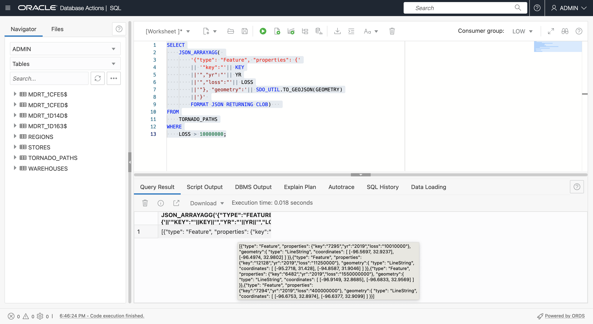

# Renvoyer GeoJSON

## Présentation

GeoJSON est le format préféré pour l'intégration des données spatiales par les développeurs. Pratiquement toutes les bibliothèques client spatiales et de mappage utilisent GeoJSON. Il est donc important de renvoyer le contenu et les résultats de Spatial en tant que GeoJSON. Reportez-vous à l'**atelier pratique 3 - Introduction** pour obtenir une explication de GeoJSON. Dans cet exercice, vous allez générer des documents GeoJSON à partir de tables avec géométries. Dans la pratique, la valeur de la génération de GeoJSON dans ADB consiste à renvoyer GeoJSON à divers clients, puis à fournir le contenu à partir de leur structure. Par exemple, SQL et PL/SQL renvoyant GeoJSON peuvent être exploités par Oracle REST Data Services (ORDS) pour publier des API REST basées sur l'emplacement renvoyant des documents GeoJSON, et Oracle Data Science pour les combiner avec des bibliothèques d'apprentissage automatique spatiales open source populaires qui prennent en charge nativement GeoJSON.

Temps estimé : 15 minutes

Regardez la vidéo ci-dessous pour une présentation rapide du laboratoire. [Préparer les données spatiales](videohub:1_bj22bt29)

### Objectifs

Dans cet exercice, vous allez :

*   Découvrez la transmission native de JSON dans Oracle Autonomous Database
*   Convertir des tables avec géométries en documents GeoJSON pour prendre en charge l'intégration des développeurs

### Prérequis

*   Achèvement de l'atelier 3 : Préparer les données spatiales

## Tâche 1 : créer le document GeoJSON à partir des résultats de la requête

1.  Commencez par renvoyer une géométrie de chemin de tornade au format GeoJSON.
    
        <copy> 
        SELECT
            SDO_UTIL.TO_GEOJSON(GEOMETRY)
        FROM
            TORNADO_PATHS
        WHERE
            LOSS > 10000000;
        </copy>
        
    
    
    
2.  Ensuite, utilisez la fonction JSON\_ARRAYAGG( ) pour convertir des lignes de géométries GeoJSON en tableau, si nécessaire pour créer le document GeoJSON. Notez l'argument **RETURNING CLOB** qui est nécessaire car les géométries comportant de nombreuses coordonnées (comme les polygones complexes) peuvent générer de très longues chaînes. Passez le pointeur de la souris sur le résultat pour voir le tableau JSON.
    
        <copy> 
        SELECT
            JSON_ARRAYAGG(
                SDO_UTIL.TO_GEOJSON(GEOMETRY) 
                FORMAT JSON RETURNING CLOB )
        FROM
            TORNADO_PATHS
        WHERE
            LOSS > 10000000;
        </copy>
        
    
    
    
3.  Le tableau de fonctionnalités doit inclure des géométries et des propriétés. Exécutez la requête suivante pour construire des éléments du tableau de fonctionnalités. Passez le pointeur de la souris sur le résultat pour voir le tableau JSON avec les propriétés.
    
        <copy> 
        SELECT
            '{"type": "Feature", "properties": {'
            || '"key":"'|| KEY
            ||'","yr":"'|| YR
            ||'","loss":"'|| LOSS
            ||'"}, "geometry":'|| SDO_UTIL.TO_GEOJSON(GEOMETRY)
            ||'}' AS features
        FROM
            TORNADO_PATHS
        WHERE
            LOSS > 10000000;
        </copy>
        
    
    
    
4.  Utilisez JSON\_ARRAYAGG( ) pour compiler les résultats précédents dans un tableau. Il s'agit maintenant du tableau des fonctionnalités réelles. Passez le pointeur de la souris sur le résultat pour afficher une fenêtre contextuelle avec le résultat.
    
        <copy> 
        SELECT
            JSON_ARRAYAGG( 
                '{"type": "Feature", "properties": {'
                || '"key":"'|| KEY
                ||'","yr":"'|| YR
                ||'","loss":"'|| LOSS
                ||'"}, "geometry":'|| SDO_UTIL.TO_GEOJSON(GEOMETRY)
                ||'}' 
                FORMAT JSON RETURNING CLOB)   
        FROM
            TORNADO_PATHS
        WHERE
            LOSS > 10000000;
        </copy>
        
    
    
    
5.  Pour terminer la construction d'un document GeoJSON, incluez les clés de niveau supérieur **type** et **fonctionnalités**, ainsi qu'une accolade fermante. Cela renvoie désormais un document GeoJSON complet. Passez le pointeur de la souris sur le résultat pour afficher une fenêtre contextuelle avec le résultat.
    
        <copy> 
        SELECT
            '{"type": "FeatureCollection", "features":'
            || JSON_ARRAYAGG( 
                '{"type": "Feature", "properties": {'
                || '"key":"'|| KEY
                ||'","yr":"'|| YR
                ||'","loss":"'|| LOSS
                ||'"}, "geometry":'|| SDO_UTIL.TO_GEOJSON(GEOMETRY)
                ||'}' 
                FORMAT JSON RETURNING CLOB) 
            ||'}'
            AS GEOJSON
        FROM
            TORNADO_PATHS
        WHERE
            LOSS > 10000000;
        </copy>
        

6.  Cliquez avec le bouton droit de la souris dans la cellule de résultats et sélectionnez **Copier**.
    
    
    
7.  Vérifiez le résultat en le affichant. Cliquez [ici](http://geojson.io) pour ouvrir geojson.io dans un nouvel onglet de navigateur. Effacez le contenu du panneau de droite sous JSON (sélectionnez tout > supprimer), puis collez le contenu GeoJSON copié à partir de la feuille de calcul SQL. Cliquez sur l'une des lignes de tornade pour voir une fenêtre contextuelle qui inclut ses propriétés.
    
    
    
8.  Pour rendre le résultat un peu plus intéressant, exécutez la commande suivante pour créer un document GeoJSON avec des géométries qui sont des tampons de 5 miles entourant les chemins de tornade. Notez qu'une nouvelle clé de propriété est ajoutée pour indiquer la distance du tampon. Exécutez la requête, puis copiez le résultat, comme précédemment.
    
        <copy> 
        SELECT
           '{"type": "FeatureCollection", "features":'
           || JSON_ARRAYAGG( 
               '{"type": "Feature", "properties": {'
               || '"key":"'|| KEY
               ||'","yr":"'|| YR
               ||'","loss":"'|| LOSS
               ||'","buffer":"5 MI'
               ||'"}, "geometry":'|| SDO_UTIL.TO_GEOJSON(
                                      SDO_GEOM.SDO_BUFFER(GEOMETRY, 5, 1, 'unit=MILE'))
               ||'}' 
               FORMAT JSON RETURNING CLOB)   
           ||'}'
           AS GEOJSON
        FROM
            TORNADO_PATHS
        WHERE
            LOSS > 10000000;
        </copy>
        
    
    
    
9.  Ouvrez un nouvel onglet geojson.io, effacez le panneau JSON à droite et collez le résultat copié à partir de votre feuille de calcul SQL. Observez les géométries de tampon et cliquez dessus pour afficher une fenêtre contextuelle contenant les propriétés, y compris la clé de tampon ajoutée.
    
    
    

Dans un scénario réel, l'élément GeoJSON que vous avez généré est servi aux clients, tels que la mise en correspondance des bibliothèques JavaScript et des blocs-notes Python, par exemple via JDBC ou des API publiées avec Oracle REST Data Services.

Vous pouvez maintenant **passer à l'exercice suivant**.

## En savoir plus

*   [Portail produit spatial](https://oracle.com/goto/spatial)
*   [Documentation spatiale](https://docs.oracle.com/en/database/oracle/oracle-database/19/spatl)
*   [Articles de blog sur Oracle Database Insider](https://blogs.oracle.com/database/category/db-spatial)

## Accusés de réception

*   **Auteur** - David Lapp, Database Product Management, Oracle
*   **Dernière mise à jour par/date** - David Lapp, septembre 2022