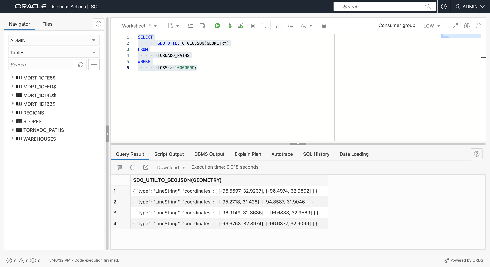

# GeoJSONを返します

## 概要

GeoJSONは、開発者が空間データを統合するための推奨形式です。事実上、すべての空間およびマッピング・クライアント・ライブラリはGeoJSONを使用します。そのため、Spatialのコンテンツおよび結果をGeoJSONとして返すことが重要です。GeoJSONの説明は、**ラボ3 - 概要**を参照してください。この演習では、ジオメトリを含む表からGeoJSONドキュメントを生成します。実際には、ADBでGeoJSONを生成する値は、GeoJSONを様々なクライアントに戻し、フレームワークからコンテンツを配信することです。たとえば、GeoJSONを返すSQLおよびPL/SQLは、Oracle REST Data Services (ORDS)でGeoJSONドキュメントを返す場所ベースのREST APIを公開し、Oracle Data ScienceでGeoJSONをネイティブにサポートする一般的なオープン・ソースの空間MLライブラリと組み合せることができます。

見積時間: 15分

ラボのクイック・ウォークスルーについては、次のビデオをご覧ください。[空間データの準備](videohub:1_bj22bt29)

### 目標

この演習では、次のことを行います。

*   Oracle Autonomous DatabaseでのネイティブJSONハンドリングの詳細
*   ジオメトリを含む表をGeoJSONドキュメントに変換して、開発者統合をサポート

### 前提条件

*   演習3: 空間データの準備の完了

## タスク1: 問合せ結果からのGeoJSONドキュメントの構成

1.  まず、トルネード・パス・ジオメトリをGeoJSON形式で戻します。
    
        <copy> 
        SELECT
            SDO_UTIL.TO_GEOJSON(GEOMETRY)
        FROM
            TORNADO_PATHS
        WHERE
            LOSS > 10000000;
        </copy>
        
    
    
    
2.  次に、JSON\_ARRAYAGG( )関数を使用して、必要に応じてGeoJSONジオメトリの行を配列に変換し、GeoJSONドキュメントを作成します。多数の座標(複雑なポリゴンなど)を持つジオメトリが非常に長い文字列になる可能性があるため、必要な**RETURNING CLOB**引数に注意してください。結果の上にマウスを置くと、JSON配列が表示されます。
    
        <copy> 
        SELECT
            JSON_ARRAYAGG(
                SDO_UTIL.TO_GEOJSON(GEOMETRY) 
                FORMAT JSON RETURNING CLOB )
        FROM
            TORNADO_PATHS
        WHERE
            LOSS > 10000000;
        </copy>
        
    
    
    
3.  機能配列には、ジオメトリとプロパティの両方を含める必要があります。次の問合せを実行して、機能配列の要素を構成します。結果の上にマウスを置くと、プロパティを含むJSON配列が表示されます。
    
        <copy> 
        SELECT
            '{"type": "Feature", "properties": {'
            || '"key":"'|| KEY
            ||'","yr":"'|| YR
            ||'","loss":"'|| LOSS
            ||'"}, "geometry":'|| SDO_UTIL.TO_GEOJSON(GEOMETRY)
            ||'}' AS features
        FROM
            TORNADO_PATHS
        WHERE
            LOSS > 10000000;
        </copy>
        
    
    
    
4.  JSON\_ARRAYAGG( )を使用して、前の結果を配列にコンパイルします。これが実際のフィーチャ配列になります。結果の上にマウスを置くと、結果のポップアップが表示されます。
    
        <copy> 
        SELECT
            JSON_ARRAYAGG( 
                '{"type": "Feature", "properties": {'
                || '"key":"'|| KEY
                ||'","yr":"'|| YR
                ||'","loss":"'|| LOSS
                ||'"}, "geometry":'|| SDO_UTIL.TO_GEOJSON(GEOMETRY)
                ||'}' 
                FORMAT JSON RETURNING CLOB)   
        FROM
            TORNADO_PATHS
        WHERE
            LOSS > 10000000;
        </copy>
        
    
    
    
5.  GeoJSONドキュメントの構築を完了するには、トップ・レベルのキー**タイプ**と**機能**、および閉じ中カッコを含めます。これで、完全なGeoJSONドキュメントが返されます。結果の上にマウスを置くと、結果のポップアップが表示されます。
    
        <copy> 
        SELECT
            '{"type": "FeatureCollection", "features":'
            || JSON_ARRAYAGG( 
                '{"type": "Feature", "properties": {'
                || '"key":"'|| KEY
                ||'","yr":"'|| YR
                ||'","loss":"'|| LOSS
                ||'"}, "geometry":'|| SDO_UTIL.TO_GEOJSON(GEOMETRY)
                ||'}' 
                FORMAT JSON RETURNING CLOB) 
            ||'}'
            AS GEOJSON
        FROM
            TORNADO_PATHS
        WHERE
            LOSS > 10000000;
        </copy>
        

6.  結果セルを右クリックし、**「コピー」**を選択します。
    
    
    
7.  レンダリングによって結果を確認します。[ここ](http://geojson.io)をクリックして、新しいブラウザ・タブでgeojson.ioを開きます。右側のパネルの「JSON」の下でコンテンツをクリアし(すべて選択して削除)、SQLワークシートからコピーしたGeoJSONに貼り付けます。竜巻線のいずれかをクリックして、そのプロパティを含むポップアップを表示します。
    
    
    
8.  結果をより興味深いものにするには、次を実行して、トルネード・パスを囲む5マイルのバッファであるジオメトリを含むGeoJSONドキュメントを作成します。バッファ距離を示す新しいプロパティ・キーが追加されています。問合せを実行し、前述のように結果をコピーします。
    
        <copy> 
        SELECT
           '{"type": "FeatureCollection", "features":'
           || JSON_ARRAYAGG( 
               '{"type": "Feature", "properties": {'
               || '"key":"'|| KEY
               ||'","yr":"'|| YR
               ||'","loss":"'|| LOSS
               ||'","buffer":"5 MI'
               ||'"}, "geometry":'|| SDO_UTIL.TO_GEOJSON(
                                      SDO_GEOM.SDO_BUFFER(GEOMETRY, 5, 1, 'unit=MILE'))
               ||'}' 
               FORMAT JSON RETURNING CLOB)   
           ||'}'
           AS GEOJSON
        FROM
            TORNADO_PATHS
        WHERE
            LOSS > 10000000;
        </copy>
        
    
    
    
9.  新しいgeojson.ioタブを開き、右側の「JSON」パネルをクリアして、SQLワークシートからコピーした結果を貼り付けます。バッファ・ジオメトリを確認し、いずれかをクリックして、追加されたバッファ・キーを含むプロパティを含むポップアップを表示します。
    
    
    

実際のシナリオでは、生成されたGeoJSONは、たとえばJDBCやOracle REST Data Servicesで公開されたAPIを介して、JavaScriptライブラリやPythonノートブックのマッピングなどのクライアントに提供されます。

**次の演習に進む**ことができます。

## さらに学ぶ

*   [空間製品ポータル](https://oracle.com/goto/spatial)
*   [Spatialのマニュアル](https://docs.oracle.com/en/database/oracle/oracle-database/19/spatl)
*   [Spatialのブログ記事: Oracle Database Insider](https://blogs.oracle.com/database/category/db-spatial)

## 謝辞

*   **著者** - Oracle、データベース製品管理、David Lapp氏
*   **最終更新者/日付** - David Lapp、2022年9月