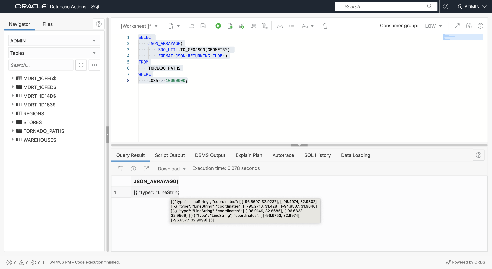

# Retornar GeoJSON

## Introdução

GeoJSON é o formato preferido para integração do desenvolvedor de dados espaciais. Praticamente todas as bibliotecas de clientes espaciais e de mapeamento consomem GeoJSON. Portanto, é importante retornar conteúdo e resultados do Spatial como GeoJSON. Consulte o **Laboratório 3 - Introdução** para obter uma explicação de GeoJSON. Neste laboratório, você gerará documentos GeoJSON de tabelas com geometrias. Na prática, o valor de gerar GeoJSON no ADB está em retornar GeoJSON para diversos clientes e que, em seguida, entregam o conteúdo de sua estrutura. Por exemplo, SQL e PL/SQL retornando GeoJSON podem ser aproveitados pelo Oracle REST Data Services (ORDS) para publicar APIs REST baseadas em localização que retornam documentos GeoJSON e o Oracle Data Science para combinar com bibliotecas de ML espaciais de código aberto populares que suportam nativamente GeoJSON.

Tempo Estimado: 15 minutos

Assista ao vídeo abaixo para uma rápida apresentação do laboratório. [Preparar dados espaciais](videohub:1_bj22bt29)

### Objetivos

Neste laboratório, você vai:

*   Explore o processamento nativo de JSON no Oracle Autonomous Database
*   Converta tabelas com geometrias em documentos GeoJSON para oferecer suporte à integração do desenvolvedor

### Pré-requisitos

*   Conclusão do Laboratório 3: Preparar Dados Espaciais

## Tarefa 1: Construir documento GeoJSON com base nos resultados da consulta

1.  Comece retornando uma geometria de caminho de tornado como no formato GeoJSON.
    
        <copy> 
        SELECT
            SDO_UTIL.TO_GEOJSON(GEOMETRY)
        FROM
            TORNADO_PATHS
        WHERE
            LOSS > 10000000;
        </copy>
        
    
    
    
2.  Em seguida, use a função JSON\_ARRAYAGG( ) para converter linhas de geometrias GeoJSON em um array, conforme necessário para criar o documento GeoJSON. Observe que o argumento **RETURNING CLOB** é necessário, pois geometrias com muitas coordenadas (como polígonos complexos) podem resultar em strings muito longas. Passe o mouse sobre o resultado para ver o array JSON.
    
        <copy> 
        SELECT
            JSON_ARRAYAGG(
                SDO_UTIL.TO_GEOJSON(GEOMETRY) 
                FORMAT JSON RETURNING CLOB )
        FROM
            TORNADO_PATHS
        WHERE
            LOSS > 10000000;
        </copy>
        
    
    
    
3.  O array de recursos deve incluir geometrias e propriedades. Execute a consulta a seguir para construir elementos da matriz de recursos. Passe o mouse sobre o resultado para ver o array JSON agora com propriedades.
    
        <copy> 
        SELECT
            '{"type": "Feature", "properties": {'
            || '"key":"'|| KEY
            ||'","yr":"'|| YR
            ||'","loss":"'|| LOSS
            ||'"}, "geometry":'|| SDO_UTIL.TO_GEOJSON(GEOMETRY)
            ||'}' AS features
        FROM
            TORNADO_PATHS
        WHERE
            LOSS > 10000000;
        </copy>
        
    
    
    
4.  Use JSON\_ARRAYAGG( ) para compilar os resultados anteriores em um array. Esta é agora a matriz de recursos real. Passe o mouse sobre o resultado para ver um pop-up com o resultado.
    
        <copy> 
        SELECT
            JSON_ARRAYAGG( 
                '{"type": "Feature", "properties": {'
                || '"key":"'|| KEY
                ||'","yr":"'|| YR
                ||'","loss":"'|| LOSS
                ||'"}, "geometry":'|| SDO_UTIL.TO_GEOJSON(GEOMETRY)
                ||'}' 
                FORMAT JSON RETURNING CLOB)   
        FROM
            TORNADO_PATHS
        WHERE
            LOSS > 10000000;
        </copy>
        
    
    
    
5.  Para concluir a construção de um documento GeoJSON, inclua as teclas de nível superior **type**, **features** e uma chave de fechamento. Agora, isso retorna um documento GeoJSON completo. Passe o mouse sobre o resultado para ver um pop-up com o resultado.
    
        <copy> 
        SELECT
            '{"type": "FeatureCollection", "features":'
            || JSON_ARRAYAGG( 
                '{"type": "Feature", "properties": {'
                || '"key":"'|| KEY
                ||'","yr":"'|| YR
                ||'","loss":"'|| LOSS
                ||'"}, "geometry":'|| SDO_UTIL.TO_GEOJSON(GEOMETRY)
                ||'}' 
                FORMAT JSON RETURNING CLOB) 
            ||'}'
            AS GEOJSON
        FROM
            TORNADO_PATHS
        WHERE
            LOSS > 10000000;
        </copy>
        

6.  Clique com o botão direito do mouse na célula de resultados e selecione **Copiar**.
    
    
    
7.  Verifique o resultado renderizando. Clique [aqui](http://geojson.io) para abrir geojson.io em uma nova guia do navegador. Limpe o conteúdo no painel direito em JSON (selecione tudo > excluir) e cole em GeoJSON copiado da Planilha SQL. Clique em qualquer uma das linhas de tornado para ver um pop-up que inclua suas propriedades.
    
    
    
8.  Para tornar o resultado um pouco mais interessante, execute o seguinte para criar um documento GeoJSON com geometrias que são buffers de 5 milhas ao redor dos caminhos de tornado. Observe que uma nova chave de propriedade é adicionada para indicar a distância do buffer. Execute a consulta e, como já fez anteriormente, copie o resultado.
    
        <copy> 
        SELECT
           '{"type": "FeatureCollection", "features":'
           || JSON_ARRAYAGG( 
               '{"type": "Feature", "properties": {'
               || '"key":"'|| KEY
               ||'","yr":"'|| YR
               ||'","loss":"'|| LOSS
               ||'","buffer":"5 MI'
               ||'"}, "geometry":'|| SDO_UTIL.TO_GEOJSON(
                                      SDO_GEOM.SDO_BUFFER(GEOMETRY, 5, 1, 'unit=MILE'))
               ||'}' 
               FORMAT JSON RETURNING CLOB)   
           ||'}'
           AS GEOJSON
        FROM
            TORNADO_PATHS
        WHERE
            LOSS > 10000000;
        </copy>
        
    
    
    
9.  Abra uma nova guia geojson.io, limpe o painel JSON à direita e cole o resultado copiado da sua Planilha SQL. Observe as geometrias do buffer e clique em uma para ver um pop-up com propriedades, incluindo a chave do buffer que foi adicionada.
    
    
    

Em um cenário do mundo real, o GeoJSON gerado seria servido aos clientes, como o mapeamento de bibliotecas JavaScript e notebooks Python, por exemplo, por meio de JDBC ou APIs publicadas com o Oracle REST Data Services.

Agora você pode **prosseguir para o próximo laboratório**.

## Saiba mais

*   [Portal espacial de produtos](https://oracle.com/goto/spatial)
*   [Documentação espacial](https://docs.oracle.com/en/database/oracle/oracle-database/19/spatl)
*   [Publicações no blog Spatial sobre o Oracle Database Insider](https://blogs.oracle.com/database/category/db-spatial)

## Agradecimentos

*   **Autor** - David Lapp, Database Product Management, Oracle
*   **Última Atualização em/Data** - David Lapp, setembro de 2022