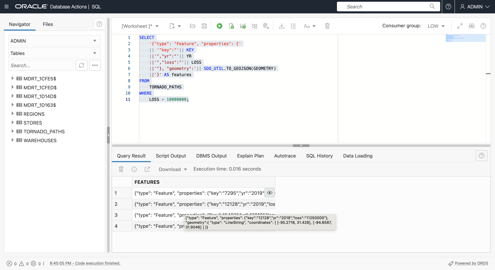

# 返回 GeoJSON

## 简介

GeoJSON 是开发人员集成空间数据的首选格式。几乎所有空间和映射客户机库都使用 GeoJSON。因此，将 Spatial 的内容和结果返回为 GeoJSON 非常重要。有关 GeoJSON 的说明，请参阅**练习 3 - 简介**。在此实验室中，您将从具有几何图形的表生成 GeoJSON 文档。在实践中，在 ADB 中生成 GeoJSON 的价值在于将 GeoJSON 返回到不同的客户端，然后从其框架中提供内容。例如，Oracle REST Data Services (ORDS) 可以利用返回 GeoJSON 的 SQL 和 PL/SQL 发布基于位置的 REST API（返回 GeoJSON 文档）和 Oracle Data Science（与本地支持 GeoJSON 的常用开源空间 ML 库结合使用）。

估计时间：15 分钟

观看下面的视频，快速浏览实验室。[准备空间数据](videohub:1_bj22bt29)

### 目标

在此实验室中，您将：

*   了解 Oracle Autonomous Database 中的原生 JSON 交接
*   将具有几何图形的表转换为 GeoJSON 文档以支持开发人员集成

### 先备条件

*   实验室 3 的完成：准备空间数据

## 任务 1：根据查询结果构建 GeoJSON 文档

1.  首先返回 GeoJSON 格式的龙卷风路径几何图形。
    
        <copy> 
        SELECT
            SDO_UTIL.TO_GEOJSON(GEOMETRY)
        FROM
            TORNADO_PATHS
        WHERE
            LOSS > 10000000;
        </copy>
        
    
    
    
2.  接下来，根据需要使用 JSON\_ARRAYAGG( ) 函数将 GeoJSON 几何体的行转换为数组，以构建 GeoJSON 文档。请注意参数 **RETURNING CLOB** 是必需的，因为具有多个坐标（如复杂多边形）的几何图形会导致字符串非常长。将鼠标悬停在结果上即可查看 JSON 数组。
    
        <copy> 
        SELECT
            JSON_ARRAYAGG(
                SDO_UTIL.TO_GEOJSON(GEOMETRY) 
                FORMAT JSON RETURNING CLOB )
        FROM
            TORNADO_PATHS
        WHERE
            LOSS > 10000000;
        </copy>
        
    
    
    
3.  功能数组必须包括几何图形和属性。运行以下查询以构建功能数组的元素。将鼠标悬停在结果上即可立即查看具有属性的 JSON 数组。
    
        <copy> 
        SELECT
            '{"type": "Feature", "properties": {'
            || '"key":"'|| KEY
            ||'","yr":"'|| YR
            ||'","loss":"'|| LOSS
            ||'"}, "geometry":'|| SDO_UTIL.TO_GEOJSON(GEOMETRY)
            ||'}' AS features
        FROM
            TORNADO_PATHS
        WHERE
            LOSS > 10000000;
        </copy>
        
    
    
    
4.  使用 JSON\_ARRAYAGG( ) 将以前的结果编译为数组。这现在是实际特征数组。将鼠标悬停在结果上可看到包含结果的弹出窗口。
    
        <copy> 
        SELECT
            JSON_ARRAYAGG( 
                '{"type": "Feature", "properties": {'
                || '"key":"'|| KEY
                ||'","yr":"'|| YR
                ||'","loss":"'|| LOSS
                ||'"}, "geometry":'|| SDO_UTIL.TO_GEOJSON(GEOMETRY)
                ||'}' 
                FORMAT JSON RETURNING CLOB)   
        FROM
            TORNADO_PATHS
        WHERE
            LOSS > 10000000;
        </copy>
        
    
    
    
5.  要完成 GeoJSON 文档的构造，请包括顶层键 **type** 和 **features** ，以及右大括号。此时将返回完整的 GeoJSON 文档。将鼠标悬停在结果上可看到包含结果的弹出窗口。
    
        <copy> 
        SELECT
            '{"type": "FeatureCollection", "features":'
            || JSON_ARRAYAGG( 
                '{"type": "Feature", "properties": {'
                || '"key":"'|| KEY
                ||'","yr":"'|| YR
                ||'","loss":"'|| LOSS
                ||'"}, "geometry":'|| SDO_UTIL.TO_GEOJSON(GEOMETRY)
                ||'}' 
                FORMAT JSON RETURNING CLOB) 
            ||'}'
            AS GEOJSON
        FROM
            TORNADO_PATHS
        WHERE
            LOSS > 10000000;
        </copy>
        

6.  在结果单元格中右键单击，然后选择**复制**。
    
    
    
7.  通过呈现来验证结果。单击[此处](http://geojson.io)在新的浏览器选项卡中打开 geojson.io。清除右侧面板上 JSON 下的内容（选择全部 > 删除），然后粘贴从 SQL 工作表中复制的 GeoJSON 中。单击任何龙卷风线以查看包括其属性的弹出窗口。
    
    
    
8.  要使结果更有趣，请运行以下命令创建包含几何图形的 GeoJSON 文档，这些几何图形是围绕龙卷风路径的 5 英里缓冲区。请注意，添加了一个新的属性键来指示缓冲区距离。运行查询，然后像之前那样复制结果。
    
        <copy> 
        SELECT
           '{"type": "FeatureCollection", "features":'
           || JSON_ARRAYAGG( 
               '{"type": "Feature", "properties": {'
               || '"key":"'|| KEY
               ||'","yr":"'|| YR
               ||'","loss":"'|| LOSS
               ||'","buffer":"5 MI'
               ||'"}, "geometry":'|| SDO_UTIL.TO_GEOJSON(
                                      SDO_GEOM.SDO_BUFFER(GEOMETRY, 5, 1, 'unit=MILE'))
               ||'}' 
               FORMAT JSON RETURNING CLOB)   
           ||'}'
           AS GEOJSON
        FROM
            TORNADO_PATHS
        WHERE
            LOSS > 10000000;
        </copy>
        
    
    
    
9.  打开新的 geojson.io 选项卡，清除右侧的 JSON 面板，然后粘贴从 SQL 工作表中复制的结果。观察缓冲区几何图形，然后单击 1 可查看包含属性（包括添加的缓冲区关键字）的弹出窗口。
    
    
    

在实际场景中，您生成的 GeoJSON 将提供给客户端，例如映射 JavaScript 库和 Python 笔记本，例如通过 JDBC 或 Oracle REST Data Services 发布的 API。

现在，您可以**进入下一个练习**。

## 了解详细信息

*   [空间产品门户](https://oracle.com/goto/spatial)
*   [空间文档](https://docs.oracle.com/en/database/oracle/oracle-database/19/spatl)
*   [Oracle Database Insider 上的 Spatial 博客文章](https://blogs.oracle.com/database/category/db-spatial)

## 确认

*   **作者** - David Lapp，Oracle 数据库产品管理
*   **上次更新者/日期** - David Lapp，2022 年 9 月