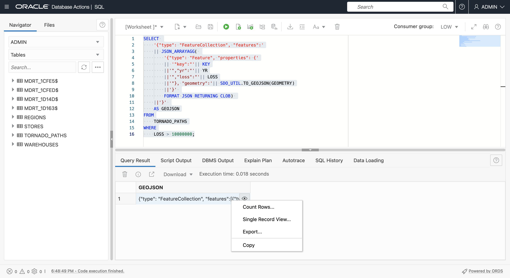

# 傳回 GeoJSON

## 簡介

GeoJSON 是開發人員空間資料整合的偏好格式。幾乎所有空間和對應用戶端程式庫都會使用 GeoJSON。因此，請務必將空間的內容和結果傳回為 GeoJSON。如需 GeoJSON 的說明，請參閱**實驗室 3 - 簡介**。在此實驗室中，您將從含有幾何資料的表格產生 GeoJSON 文件。在實務上，ADB 中產生 GeoJSON 的值會傳回 GeoJSON 給不同用戶端，然後從其架構傳遞內容。例如，Oracle REST Data Services (ORDS) 可以利用傳回 GeoJSON 的 SQL 和 PL/SQL 來發布傳回 GeoJSON 文件的位置型 REST API，以及使用 Oracle Data Science 與原生支援 GeoJSON 的熱門開源空間 ML 程式庫結合。

預估時間：15 分鐘

請觀看下方影片，快速瞭解實驗室的逐步解說。[準備空間資料](videohub:1_bj22bt29)

### 目標

在此實驗室中，您將：

*   探索 Oracle Autonomous Database 中的原生 JSON 交涉
*   將含有幾何資料的表格轉換成 GeoJSON 文件，以支援開發人員整合

### 先決條件

*   完成實驗室 3：準備空間資料

## 作業 1：從查詢結果建構 GeoJSON 文件

1.  首先，傳回 GeoJSON 格式的龍捲風路徑幾何圖形。
    
        <copy> 
        SELECT
            SDO_UTIL.TO_GEOJSON(GEOMETRY)
        FROM
            TORNADO_PATHS
        WHERE
            LOSS > 10000000;
        </copy>
        
    
    
    
2.  接著，使用 JSON\_ARRAYAGG () 函數將 GeoJSON 幾何的資料列轉換成陣列，視需要建立 GeoJSON 文件。請注意，因為具有許多座標 (例如複雜多邊形) 的幾何會產生非常長的字串，所以需要這個引數 **RETURNING CLOB** 。將滑鼠游標移至結果上方即可查看 JSON 陣列。
    
        <copy> 
        SELECT
            JSON_ARRAYAGG(
                SDO_UTIL.TO_GEOJSON(GEOMETRY) 
                FORMAT JSON RETURNING CLOB )
        FROM
            TORNADO_PATHS
        WHERE
            LOSS > 10000000;
        </copy>
        
    
    
    
3.  圖徵陣列必須同時包含幾何和性質。執行下列查詢以建構功能陣列的元素。將滑鼠游標停留在結果上方，即可立即使用屬性查看 JSON 陣列。
    
        <copy> 
        SELECT
            '{"type": "Feature", "properties": {'
            || '"key":"'|| KEY
            ||'","yr":"'|| YR
            ||'","loss":"'|| LOSS
            ||'"}, "geometry":'|| SDO_UTIL.TO_GEOJSON(GEOMETRY)
            ||'}' AS features
        FROM
            TORNADO_PATHS
        WHERE
            LOSS > 10000000;
        </copy>
        
    
    
    
4.  請使用 JSON\_ARRAYAGG () 將先前的結果編譯成陣列。現在，這是實際的功能陣列。將滑鼠游標停留在結果上方即可看見含有結果的即現式視窗。
    
        <copy> 
        SELECT
            JSON_ARRAYAGG( 
                '{"type": "Feature", "properties": {'
                || '"key":"'|| KEY
                ||'","yr":"'|| YR
                ||'","loss":"'|| LOSS
                ||'"}, "geometry":'|| SDO_UTIL.TO_GEOJSON(GEOMETRY)
                ||'}' 
                FORMAT JSON RETURNING CLOB)   
        FROM
            TORNADO_PATHS
        WHERE
            LOSS > 10000000;
        </copy>
        
    
    
    
5.  若要完成 GeoJSON 文件的建構作業，請包含頂層按鍵 **type** 和 **features** ，以及右大括號。現在會傳回完整的 GeoJSON 文件。將滑鼠游標停留在結果上方即可看見含有結果的即現式視窗。
    
        <copy> 
        SELECT
            '{"type": "FeatureCollection", "features":'
            || JSON_ARRAYAGG( 
                '{"type": "Feature", "properties": {'
                || '"key":"'|| KEY
                ||'","yr":"'|| YR
                ||'","loss":"'|| LOSS
                ||'"}, "geometry":'|| SDO_UTIL.TO_GEOJSON(GEOMETRY)
                ||'}' 
                FORMAT JSON RETURNING CLOB) 
            ||'}'
            AS GEOJSON
        FROM
            TORNADO_PATHS
        WHERE
            LOSS > 10000000;
        </copy>
        

6.  在結果儲存格中按一下滑鼠右鍵，然後選取**複製**。
    
    
    
7.  藉由轉譯來驗證結果。按一下[此處](http://geojson.io)以在新的瀏覽器頁標中開啟 geojson.io。清除 JSON 右側面板上的內容 (選取所有 > 刪除)，然後貼到從「SQL 工作表」複製的 GeoJSON 中。按一下任何龍捲風線，即可查看包含其特性的即現式視窗。
    
    
    
8.  若要讓結果變得更有趣，請執行以下操作，以建立 GeoJSON 文件，其中含有龍捲風路徑周圍的 5 英里緩衝區。請注意，會加入新的性質鍵來指示緩衝區距離。執行查詢，然後如先前所述複製結果。
    
        <copy> 
        SELECT
           '{"type": "FeatureCollection", "features":'
           || JSON_ARRAYAGG( 
               '{"type": "Feature", "properties": {'
               || '"key":"'|| KEY
               ||'","yr":"'|| YR
               ||'","loss":"'|| LOSS
               ||'","buffer":"5 MI'
               ||'"}, "geometry":'|| SDO_UTIL.TO_GEOJSON(
                                      SDO_GEOM.SDO_BUFFER(GEOMETRY, 5, 1, 'unit=MILE'))
               ||'}' 
               FORMAT JSON RETURNING CLOB)   
           ||'}'
           AS GEOJSON
        FROM
            TORNADO_PATHS
        WHERE
            LOSS > 10000000;
        </copy>
        
    
    
    
9.  開啟新的 geojson.io 頁標，清除右側的 JSON 面板，然後貼上從「SQL 工作表」複製的結果。注意緩衝區幾何，並按一下其中一個即可查看含有特性的即現式視窗，包括新增的緩衝區索引鍵。
    
    
    

在實際情況中，您產生的 GeoJSON 會提供給用戶端，例如對應 JavaScript 程式庫和 Python 筆記型電腦，例如透過使用 Oracle REST Data Services 發佈的 JDBC 或 API。

您現在可以**進入下一個實驗室**。

## 進一步瞭解

*   [空間產品入口網站](https://oracle.com/goto/spatial)
*   [空間文件](https://docs.oracle.com/en/database/oracle/oracle-database/19/spatl)
*   [Oracle Database Insider 的空間部落格文章](https://blogs.oracle.com/database/category/db-spatial)

## 確認

*   **作者** - Oracle 資料庫產品管理 David Lapp
*   **上次更新者 / 日期** - David Lapp，2022 年 9 月