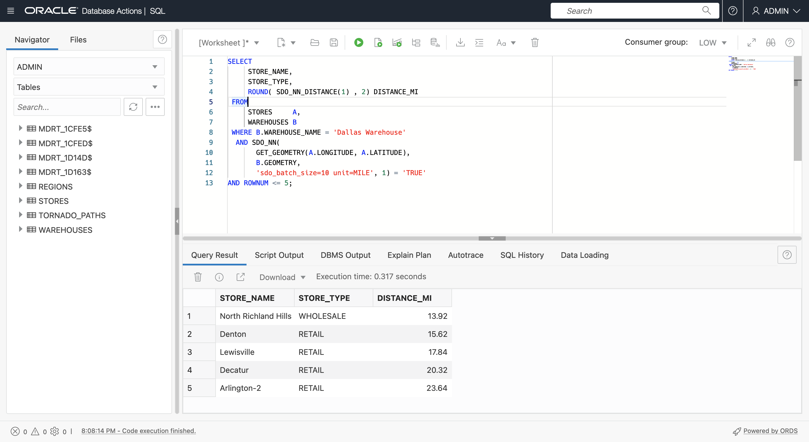
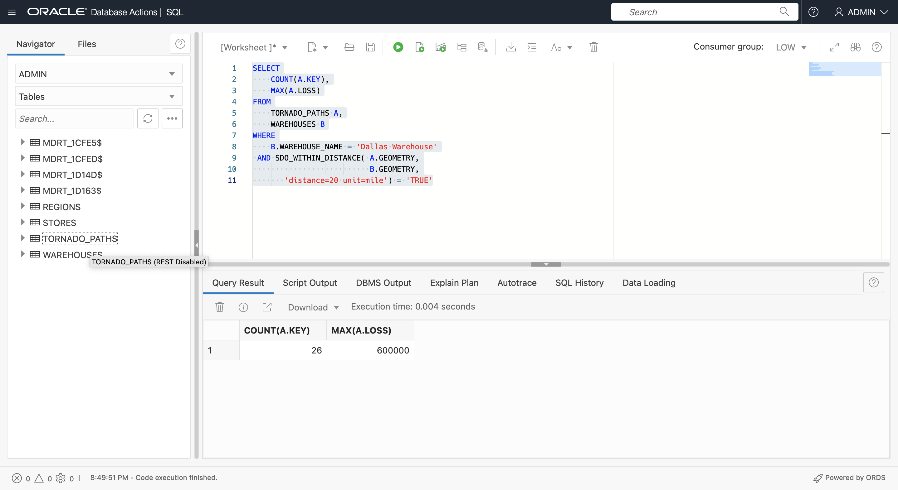
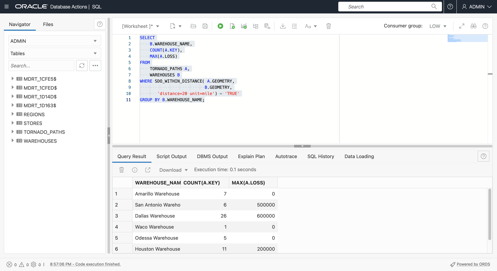
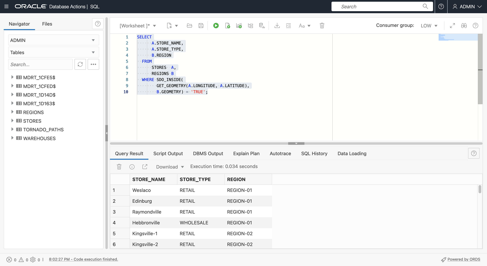
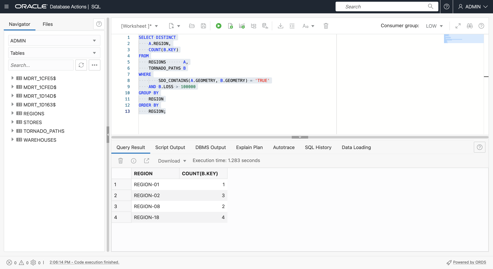

# Räumliche Abfragen

## Einführung

Diese Übung führt Sie durch grundlegende räumliche Abfragen in Oracle Autonomous Database. Sie verwenden die in der vorherigen Übung erstellten Beispieldaten, um Artikel basierend auf Näherung und Eindämmung zu identifizieren.

Geschätzte Zeit: 20 Minuten

Sehen Sie sich das Video unten an, um einen schnellen Durchgang des Labors zu erhalten. [Spatial-Daten vorbereiten](videohub:1_feaq2eu8)

### Ziele

In dieser Übung führen Sie folgende Schritte aus:

*   Spatial Querys in Oracle Database kennenlernen und ausführen

### Voraussetzungen

*   Abschluss von Übung 3: Räumliche Daten vorbereiten

### Spatial Querys

Oracle Database umfasst eine robuste Bibliothek von Funktionen und Operatoren für die räumliche Analyse. Dazu gehören räumliche Beziehungen, Messungen, Aggregationen, Transformationen und mehr. Diese Vorgänge sind über natives SQL, PL/SQL, Java-APIs und andere Sprachen mit Verbindungsmodulen zu Oracle wie Python und Node.js zugänglich.

Die gebräuchlichsten Vorgänge sind räumliche Operatoren, die räumliche Filter- und Join-Vorgänge ausführen, sowie räumliche Funktionen, die Berechnungen und Transformationen ausführen.

Räumliche Operatoren testen eine räumliche Beziehung, wie INSIDE oder WITHIN\_DISTANCE, und geben "TRUE" zurück, wenn die Beziehung vorhanden ist. Räumliche Operatoren werden in der WHERE-Klausel einer Abfrage verwendet. Generell wie folgt:

    <code>
    SELECT [fields]
    FROM [tables]
    WHERE [Spatial Operator]='TRUE'
    AND [other conditions...]
    </code>
    

Beispiel: So identifizieren Sie Elemente in MY\_POINTS, die sich in REGION-01 von MY\_REGIONS befinden:

    <code>
    SELECT *
    FROM MY_POINTS A, MY_REGIONS B
    WHERE SDO_INSIDE(A.GEOMETRY, B.GEOMETRY) = 'TRUE'
    AND B.NAME='MY_REGION-01';
    </code>
    

Räumliche Funktionen geben einen Wert zurück und können in der SELECT-Liste oder in der WHERE-Klausel verwendet werden. Generell wie folgt:

    <code>
    SELECT [Spatial Function], [other fields...]
    FROM [tables]
    WHERE [conditions]
    </code>
    

Beispiel: So rufen Sie den Bereich REGION-01 von MY\_REGIONS ab:

    <code>
    SELECT SDO_GEOM.SDO_AREA(GEOMETRY)
    FROM MY_REGIONS
    WHERE NAME='MY_REGION-01';
    </code>
    

Es sind Hunderte von Spatial SQL- und PL/SQL-Vorgängen verfügbar, wie [hier](https://docs.oracle.com/en/database/oracle/oracle-database/19/spatl/spatial-reference-information.html) dokumentiert. Sie werden einige der häufigsten in dieser Übung erkunden.

### Ziele

In dieser Übung führen Sie räumliche Abfragen durch, um die Standortbeziehungen zwischen Filialen, Lagern, Regionen und Tornadopfaden zu identifizieren.

### Voraussetzungen

*   Abschluss von Übung 3: Räumliche Daten vorbereiten

## Aufgabe 1: Näherungsabfragen

Näherung bezieht sich darauf, wie nahe Elemente zueinander sind. Die beiden wichtigsten räumlichen Näherungsoperatoren sind

*   SDO\_WITH\_DISTANCE( ) gibt Elemente innerhalb einer bestimmten Entfernung von einem anderen Element zurück
*   SDO\_NN( ) gibt die nächsten Elemente an ein anderes Element zurück.

1.  Beginnen Sie mit der Identifizierung von Filialen innerhalb von 20 Meilen von Dallas Warehouse mit **SDO\_WITHIN\_DISTANCE( )**. Beachten Sie, dass das erste Argument für **SDO\_WITHIN\_DISTANCE( )** die Funktion ist, die Geometrie für STORES (anstelle einer Geometriespalte) zurückgibt. Sie können dies verwenden, da Sie einen zugehörigen funktionsbasierten Spatial Index erstellt haben.
    
        <copy> 
         SELECT
             STORE_NAME,
             STORE_TYPE
         FROM
             STORES     A,
             WAREHOUSES B
         WHERE
              B.WAREHOUSE_NAME = 'Dallas Warehouse'
         AND SDO_WITHIN_DISTANCE(
               GET_GEOMETRY(A.LONGITUDE, A.LATITUDE),
               B.GEOMETRY,
               'distance=20 unit=mile') = 'TRUE'
        </copy>
        
    
    
    
2.  Elemente, die einem anderen Element am nächsten sind, werden mit dem Spatial-Operator **SDO\_NN( )** identifiziert, wobei NN für Nearest Neighbor steht. Führen Sie die folgende Abfrage aus, um die 5 Filialen zu ermitteln, die dem Dallas Warehouse am nächsten liegen. Beachten Sie auch hier, dass das erste Argument für **SDO\_NN( )** die Funktion ist, die Geometrie zurückgibt, die einen funktionsbasierten Spatial Index aufweist.
    
        <copy> 
         SELECT
              STORE_NAME,
              STORE_TYPE
          FROM
              STORES     A,
              WAREHOUSES B
          WHERE B.WAREHOUSE_NAME = 'Dallas Warehouse'
           AND SDO_NN(
                GET_GEOMETRY(A.LONGITUDE, A.LATITUDE),
                B.GEOMETRY,
                'sdo_batch_size=10') = 'TRUE'
         AND ROWNUM <= 5;
        </copy>
        
    
    
    
3.  Mit dem Operator **SDO\_NN( )** können Sie die Entfernung einschließen. Führen Sie die folgende Abfrage aus, um die 5 nächstgelegenen Geschäfte zum Dallas Warehouse zusammen mit ihren Entfernungen in Meilen zurückzugeben.
    
        <copy> 
         SELECT
              STORE_NAME,
              STORE_TYPE,
              ROUND( SDO_NN_DISTANCE(1) , 2) DISTANCE_MI
          FROM
              STORES     A,
              WAREHOUSES B
          WHERE B.WAREHOUSE_NAME = 'Dallas Warehouse'
           AND SDO_NN(
                GET_GEOMETRY(A.LONGITUDE, A.LATITUDE),
                B.GEOMETRY,
                'sdo_batch_size=10 unit=MILE', 1) = 'TRUE'
         AND ROWNUM <= 5;
        </copy>
        
    
    
    
4.  Führen Sie die folgende Abfrage aus, um die 5 nächstgelegenen Einzelhandelsgeschäfte zusammen mit ihren Entfernungen in Meilen an das Dallas Warehouse zurückzugeben. Beachten Sie, dass das Ergebnis Filialen enthält, die weiter als das vorherige Ergebnis liegen, da Sie nur nach Einzelhandelsgeschäften suchen.
    
        <copy> 
         SELECT
              STORE_NAME,
              STORE_TYPE,
              ROUND( SDO_NN_DISTANCE(1) , 2) DISTANCE_MI
          FROM
              STORES     A,
              WAREHOUSES B
          WHERE B.WAREHOUSE_NAME = 'Dallas Warehouse'
          AND A.STORE_TYPE='RETAIL'
           AND SDO_NN(
                GET_GEOMETRY(A.LONGITUDE, A.LATITUDE),
                B.GEOMETRY,
                'sdo_batch_size=10 unit=MILE', 1) = 'TRUE'
         AND ROWNUM <= 5;
        </copy>
        
    
    
    
5.  Räumliche Operatoren wie SDO\_NN( ) können auch zum Erstellen eines Joins verwendet werden. Führen Sie die folgende Abfrage aus, um jede Filiale mit dem Namen des nächstgelegenen Lagers zurückzugeben.
    
        <copy> 
          SELECT a.store_name, b.warehouse_name
          FROM stores a,warehouses b
          WHERE SDO_NN(b.geometry,
                  get_geometry(a.longitude,a.latitude), 
                  'sdo_num_res=1') = 'TRUE';
        </copy>
        

4.  Führen Sie die folgende Abfrage aus, um jede Filiale mit dem Namen des nächstgelegenen Lagers zusammen mit den Entfernungen in Meilen zurückzugeben.
    
        <copy> 
          SELECT
              A.STORE_NAME,
              B.WAREHOUSE_NAME,
              ROUND( SDO_NN_DISTANCE(1) , 2) DISTANCE_MI
          FROM
              STORES     A,
              WAREHOUSES B
          WHERE
              SDO_NN(B.GEOMETRY,
                     GET_GEOMETRY(A.LONGITUDE, A.LATITUDE),
                     'sdo_num_res=1 unit=MILE', 1) = 'TRUE';
        </copy>
        

4.  Näherung ist für die Aggregatanalyse nützlich. Führen Sie die folgende Abfrage aus, um die Anzahl der Tornados und den maximalen Verlust innerhalb von 20 Meilen vom Dallas Warehouse zurückzugeben.
    
        <copy> 
           SELECT
               COUNT(A.KEY),
               MAX(A.LOSS)
           FROM
               TORNADO_PATHS A,
               WAREHOUSES B
           WHERE
               B.WAREHOUSE_NAME = 'Dallas Warehouse'
            AND SDO_WITHIN_DISTANCE( A.GEOMETRY,
                                     B.GEOMETRY,
                  'distance=20 unit=mile') = 'TRUE'
        </copy>
        
    
    
    
    1.  Wenn Sie zur Verwendung räumlicher Operatoren für Joins zurückkehren, führen Sie die folgende Abfrage aus, um jedes Warehouse mit der Anzahl der Tornados und dem maximalen Verlust innerhalb von 20 Meilen zurückzugeben.
    
        <copy> 
           SELECT
               B.WAREHOUSE_NAME,
               COUNT(A.KEY),
               MAX(A.LOSS)
           FROM
               TORNADO_PATHS A,
               WAREHOUSES B
           WHERE SDO_WITHIN_DISTANCE( A.GEOMETRY,
                                     B.GEOMETRY,
                  'distance=20 unit=mile') = 'TRUE'
           GROUP BY B.WAREHOUSE_NAME;  
        </copy>
        
    
    
    

Erhöhen Sie den Entfernungswert in der Abfrage von 20 auf 50 Meilen, und beobachten Sie das neue Ergebnis.

## Aufgabe 2: Containment-Abfragen

Containment bezieht sich auf die Identifizierung von Elementen, die in einer bestimmten Region enthalten sind, und umgekehrt, wobei Regionen identifiziert werden, die bestimmte Elemente enthalten. Die räumlichen Hauptoperatoren sind

*   SDO\_INSIDE( ) gibt Elemente zurück, die sich innerhalb von Regionen befinden. Elemente an der Grenze werden nicht zurückgegeben.
*   SDO\_CONTAINS( ) gibt Bereiche zurück, die Elemente enthalten. Elemente an der Grenze gelten nicht als enthalten.
*   SDO\_ANYINTERACT( ) gibt Elemente zurück, die eine räumliche Beziehung zu anderen Elementen aufweisen, einschließlich Elemente auf einer Grenze oder Elemente, die teilweise enthalten sind, wie z.B. eine Linie, die in eine Region übergeht.

1.  Verwenden Sie SDO\_INSIDE( ), um Filialen in REGION-02 zurückzugeben, ohne Filialen an der Grenze einzuschließen.
    
        <copy> 
          SELECT
              A.STORE_NAME,
              A.STORE_TYPE
          FROM
              STORES  A,
              REGIONS B
          WHERE REGION = 'REGION-02'
          AND SDO_INSIDE(
                 GET_GEOMETRY(A.LONGITUDE, A.LATITUDE),
                 B.GEOMETRY) = 'TRUE';
         </copy>
        
    
    
    
2.  Verwenden Sie SDO\_INSIDE( ), um jede Filiale mit der Region zurückzugeben, in der sie enthalten ist. Dies ist ein weiteres Beispiel für die Verwendung eines Spatial-Operators zur Ausführung eines Joins, wie zuvor mit SDO\_NN( ). Beachten Sie, dass Speicher auf einer Regionsgrenze nicht eingeschlossen werden. Um Filialen in die Grenze aufzunehmen, verwenden Sie SDO\_ANYINTERACT( ).
    
        <copy> 
        SELECT
              A.STORE_NAME,
              A.STORE_TYPE,
              B.REGION
          FROM
              STORES  A,
              REGIONS B
          WHERE SDO_INSIDE(
                GET_GEOMETRY(A.LONGITUDE, A.LATITUDE),
                B.GEOMETRY) = 'TRUE';
         </copy>
        
    
    
    
3.  Verwenden Sie als Nächstes SDO\_ANYINTERACT( ) zur Aggregation von Tornados nach Region. Führen Sie den folgenden Befehl aus, um die Anzahl der Tornados und den maximalen Verlust für jede Region zurückzugeben. Beachten Sie, dass SDO\_ANYINTERACT( ) Elemente mit räumlichen Beziehungen zurückgibt, wie Tornado-Pfade, die ganz oder teilweise in einer Region enthalten sind.
    
        <copy> 
        SELECT
            B.REGION,
            COUNT(*),
            MAX(LOSS)
        FROM
            TORNADO_PATHS A,
            REGIONS       B
        WHERE
            SDO_ANYINTERACT(A.GEOMETRY, B.GEOMETRY) = 'TRUE'
        GROUP BY
            REGION
        ORDER BY
            REGION;
        </copy>
        
    
    
    
4.  Identifizieren Sie Regionen mit Tornado(s) mit Verlust über 100.000 US-Dollar.
    
        <copy> 
          SELECT DISTINCT
              A.REGION
          FROM
              REGIONS       A,
              TORNADO_PATHS B
          WHERE
                 SDO_CONTAINS(A.GEOMETRY, B.GEOMETRY) = 'TRUE'
          AND 
                 B.LOSS > 100000
          ORDER BY
              REGION;
        </copy>
        
    
    
    
5.  Identifizieren Sie Regionen mit Tornados mit Verlust über 100.000 US-Dollar zusammen mit der Gesamtzahl der Tornados.
    
        <copy> 
          SELECT DISTINCT
              A.REGION,
              COUNT(B.KEY)
          FROM
              REGIONS       A,
              TORNADO_PATHS B
          WHERE
                  SDO_CONTAINS(A.GEOMETRY, B.GEOMETRY) = 'TRUE'
              AND B.LOSS > 100000
          GROUP BY
              REGION
          ORDER BY
              REGION;
        </copy>
        
    
    
    

Sie können jetzt **mit der nächsten Übung fortfahren**.

## Weitere Informationen

*   [Räumliches Produktportal](https://oracle.com/goto/spatial)
*   [Räumliche Dokumentation](https://docs.oracle.com/en/database/oracle/oracle-database/19/spatl)
*   [Spatial-Blogposts auf Oracle Database Insider](https://blogs.oracle.com/database/category/db-spatial)

## Danksagungen

*   **Autor** - David Lapp, Database Product Management, Oracle
*   **Beitragende** - Karin Patenge, Datenbankproduktmanagement, Oracle
*   **Zuletzt aktualisiert am/um** - David Lapp, September 2022