# Requêtes spatiales

## Présentation

Cet atelier vous guide tout au long des requêtes spatiales de base dans Oracle Autonomous Database. Vous utiliserez les exemples de données créés au cours de l'exercice précédent pour identifier les éléments en fonction de leur proximité et de leur confinement.

Temps estimé : 20 minutes

Regardez la vidéo ci-dessous pour une présentation rapide du laboratoire. [Préparer les données spatiales](videohub:1_feaq2eu8)

### Objectifs

Dans cet exercice, vous allez :

*   Découvrir et exécuter des requêtes spatiales dans Oracle Database

### Prérequis

*   Achèvement du laboratoire 3 : Préparer les données spatiales

### A propos des requêtes spatiales

Oracle Database inclut une bibliothèque robuste de fonctions et d'opérateurs pour l'analyse spatiale. Cela inclut les relations spatiales, les mesures, les agrégations, les transformations, etc. Ces opérations sont accessibles via SQL natif, PL/SQL, les API Java et tout autre langage avec des modules de connexion à Oracle tels que Python et Node.js.

Les opérations les plus courantes sont les opérateurs spatiaux qui effectuent un filtrage et une jointure spatiaux, et les fonctions spatiales qui effectuent des calculs et des transformations.

Les opérateurs spatiaux recherchent une relation spatiale, telle que INSIDE ou WITHIN\_DISTANCE, et renvoient "TRUE" lorsque la relation existe. Les opérateurs spatiaux sont utilisés dans la clause WHERE d'une requête. Généralement comme suit :

    <code>
    SELECT [fields]
    FROM [tables]
    WHERE [Spatial Operator]='TRUE'
    AND [other conditions...]
    </code>
    

Par exemple, pour identifier les éléments dans MY\_POINTS qui se trouvent dans REGION-01 de MY\_REGIONS :

    <code>
    SELECT *
    FROM MY_POINTS A, MY_REGIONS B
    WHERE SDO_INSIDE(A.GEOMETRY, B.GEOMETRY) = 'TRUE'
    AND B.NAME='MY_REGION-01';
    </code>
    

Les fonctions spatiales renvoient une valeur et peuvent figurer dans la liste SELECT ou être utilisées dans la clause WHERE. Généralement comme suit :

    <code>
    SELECT [Spatial Function], [other fields...]
    FROM [tables]
    WHERE [conditions]
    </code>
    

Par exemple, pour obtenir la zone REGION-01 de MY\_REGIONS :

    <code>
    SELECT SDO_GEOM.SDO_AREA(GEOMETRY)
    FROM MY_REGIONS
    WHERE NAME='MY_REGION-01';
    </code>
    

Des centaines d'opérations Spatial SQL et PL/SQL sont disponibles, comme indiqué [ici](https://docs.oracle.com/en/database/oracle/oracle-database/19/spatl/spatial-reference-information.html). Vous allez découvrir quelques-unes des plus courantes de cet atelier.

### Objectifs

Dans cet exercice, vous allez effectuer des requêtes spatiales pour identifier les relations d'emplacement entre les magasins, les entrepôts, les régions et les chemins de tornade.

### Prérequis

*   Achèvement de l'atelier 3 : Préparer les données spatiales

## Tâche 1 : requêtes de proximité

La proximité correspond à la proximité des éléments entre eux. Les deux principaux opérateurs de proximité spatiale sont

*   SDO\_WITH\_DISTANCE( ) renvoie les éléments à une distance donnée d'un autre élément
*   SDO\_NN( ) renvoie les éléments les plus proches d'un autre élément.

1.  Commencez par identifier les magasins situés à moins de 20 miles de Dallas Warehouse à l'aide de **SDO\_WITHIN\_DISTANCE( )**. Notez que le premier argument de **SDO\_WITHIN\_DISTANCE( )** est la fonction qui renvoie la géométrie pour STORES (au lieu d'une colonne de géométrie). Vous pouvez l'utiliser car vous avez créé un index spatial basé sur une fonction associé.
    
        <copy> 
         SELECT
             STORE_NAME,
             STORE_TYPE
         FROM
             STORES     A,
             WAREHOUSES B
         WHERE
              B.WAREHOUSE_NAME = 'Dallas Warehouse'
         AND SDO_WITHIN_DISTANCE(
               GET_GEOMETRY(A.LONGITUDE, A.LATITUDE),
               B.GEOMETRY,
               'distance=20 unit=mile') = 'TRUE'
        </copy>
        
    
    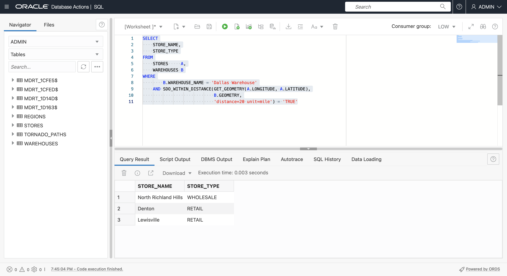
    
2.  L'identification des éléments les plus proches d'un autre élément est effectuée à l'aide de l'opérateur spatial **SDO\_NN( )**, où NN signifie Nearest Neighbor. Exécutez la requête suivante pour identifier les 5 magasins les plus proches de Dallas Warehouse. Encore une fois, notez que le premier argument de **SDO\_NN( )** est la fonction qui renvoie la géométrie, qui a un index spatial basé sur une fonction.
    
        <copy> 
         SELECT
              STORE_NAME,
              STORE_TYPE
          FROM
              STORES     A,
              WAREHOUSES B
          WHERE B.WAREHOUSE_NAME = 'Dallas Warehouse'
           AND SDO_NN(
                GET_GEOMETRY(A.LONGITUDE, A.LATITUDE),
                B.GEOMETRY,
                'sdo_batch_size=10') = 'TRUE'
         AND ROWNUM <= 5;
        </copy>
        
    
    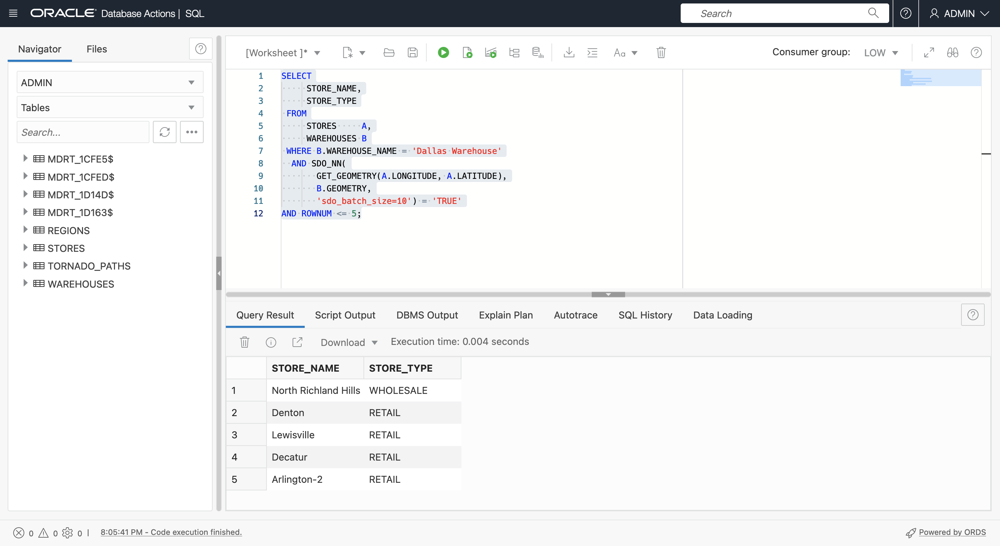
    
3.  L'opérateur **SDO\_NN( )** permet d'inclure la distance. Exécutez la requête suivante pour renvoyer les 5 magasins les plus proches de l'entrepôt de Dallas, ainsi que leurs distances en miles.
    
        <copy> 
         SELECT
              STORE_NAME,
              STORE_TYPE,
              ROUND( SDO_NN_DISTANCE(1) , 2) DISTANCE_MI
          FROM
              STORES     A,
              WAREHOUSES B
          WHERE B.WAREHOUSE_NAME = 'Dallas Warehouse'
           AND SDO_NN(
                GET_GEOMETRY(A.LONGITUDE, A.LATITUDE),
                B.GEOMETRY,
                'sdo_batch_size=10 unit=MILE', 1) = 'TRUE'
         AND ROWNUM <= 5;
        </copy>
        
    
    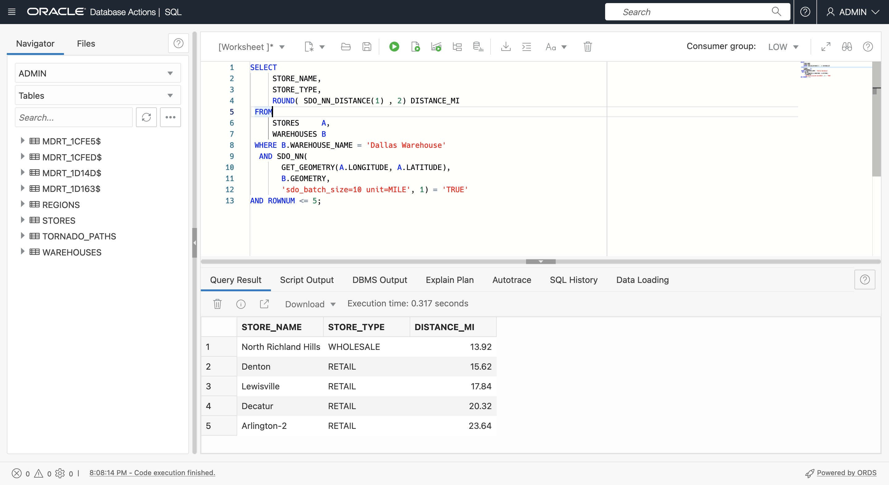
    
4.  Exécutez la requête suivante pour renvoyer les 5 magasins de détail les plus proches à l'entrepôt de Dallas avec leurs distances en miles. Notez que le résultat inclut les magasins plus loin que le résultat précédent car vous ne recherchez que des magasins de détail.
    
        <copy> 
         SELECT
              STORE_NAME,
              STORE_TYPE,
              ROUND( SDO_NN_DISTANCE(1) , 2) DISTANCE_MI
          FROM
              STORES     A,
              WAREHOUSES B
          WHERE B.WAREHOUSE_NAME = 'Dallas Warehouse'
          AND A.STORE_TYPE='RETAIL'
           AND SDO_NN(
                GET_GEOMETRY(A.LONGITUDE, A.LATITUDE),
                B.GEOMETRY,
                'sdo_batch_size=10 unit=MILE', 1) = 'TRUE'
         AND ROWNUM <= 5;
        </copy>
        
    
    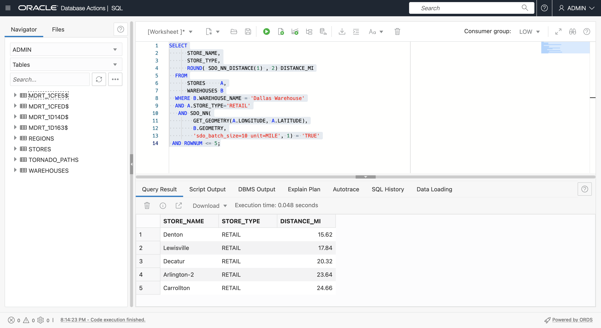
    
5.  Des opérateurs spatiaux tels que SDO\_NN( ) peuvent également être utilisés pour créer une jointure. Exécutez la requête suivante pour renvoyer chaque magasin avec le nom de l'entrepôt le plus proche.
    
        <copy> 
          SELECT a.store_name, b.warehouse_name
          FROM stores a,warehouses b
          WHERE SDO_NN(b.geometry,
                  get_geometry(a.longitude,a.latitude), 
                  'sdo_num_res=1') = 'TRUE';
        </copy>
        

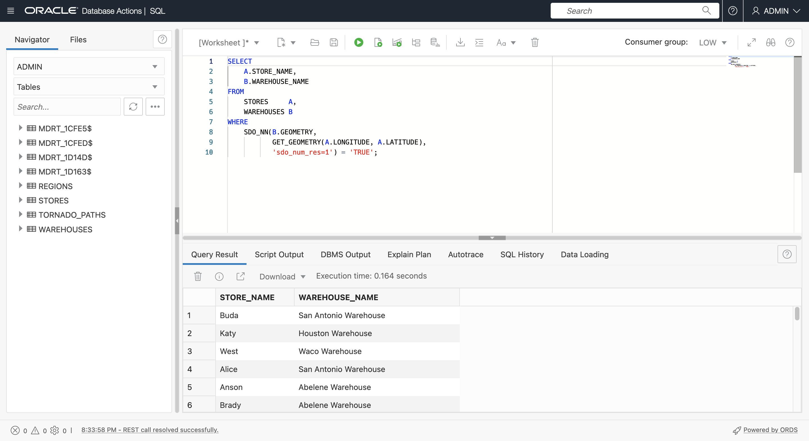

4.  Exécutez la requête suivante pour renvoyer chaque magasin avec le nom de l'entrepôt le plus proche et les distances en miles.
    
        <copy> 
          SELECT
              A.STORE_NAME,
              B.WAREHOUSE_NAME,
              ROUND( SDO_NN_DISTANCE(1) , 2) DISTANCE_MI
          FROM
              STORES     A,
              WAREHOUSES B
          WHERE
              SDO_NN(B.GEOMETRY,
                     GET_GEOMETRY(A.LONGITUDE, A.LATITUDE),
                     'sdo_num_res=1 unit=MILE', 1) = 'TRUE';
        </copy>
        

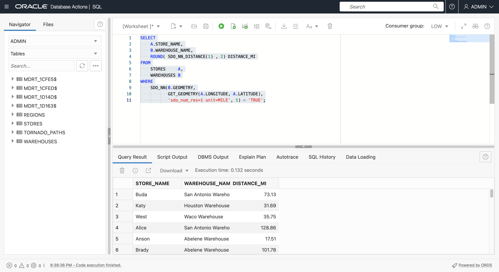

4.  La proximité est utile pour l'analyse agrégée. Exécutez la requête suivante pour renvoyer le nombre de tornades et la perte maximale à moins de 20 miles de l'entrepôt de Dallas.
    
        <copy> 
           SELECT
               COUNT(A.KEY),
               MAX(A.LOSS)
           FROM
               TORNADO_PATHS A,
               WAREHOUSES B
           WHERE
               B.WAREHOUSE_NAME = 'Dallas Warehouse'
            AND SDO_WITHIN_DISTANCE( A.GEOMETRY,
                                     B.GEOMETRY,
                  'distance=20 unit=mile') = 'TRUE'
        </copy>
        
    
    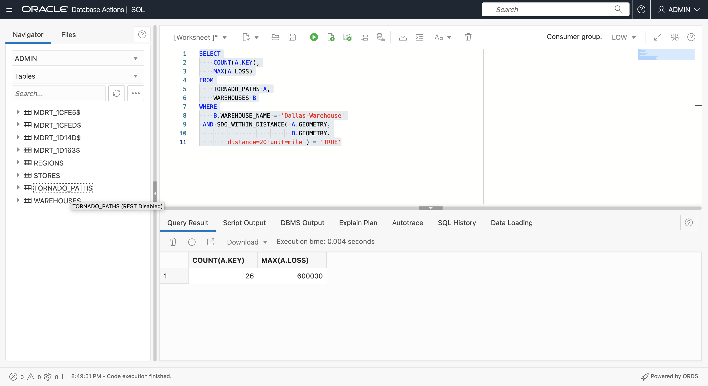
    
    1.  Revenant à l'utilisation des opérateurs Spatial pour les jointures, exécutez la requête suivante pour renvoyer chaque entrepôt avec le nombre de tornades et la perte maximale dans les 20 miles.
    
        <copy> 
           SELECT
               B.WAREHOUSE_NAME,
               COUNT(A.KEY),
               MAX(A.LOSS)
           FROM
               TORNADO_PATHS A,
               WAREHOUSES B
           WHERE SDO_WITHIN_DISTANCE( A.GEOMETRY,
                                     B.GEOMETRY,
                  'distance=20 unit=mile') = 'TRUE'
           GROUP BY B.WAREHOUSE_NAME;  
        </copy>
        
    
    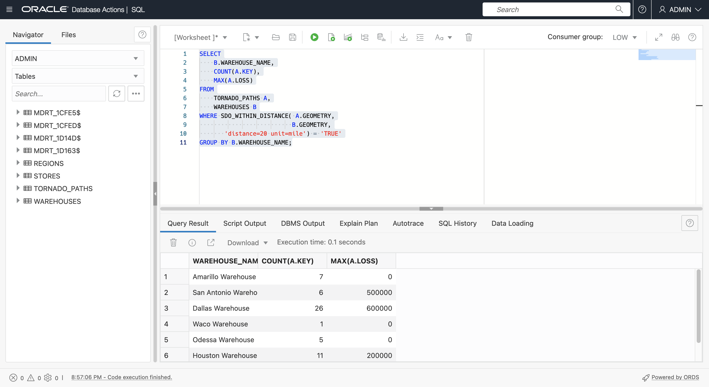
    

Augmentez la valeur de distance dans la requête de 20 à 50 mi et observez le nouveau résultat.

## Tâche 2 : Interrogations de confinement

Le conteneur fait référence à l'identification des éléments contenus dans une région spécifique, et vice versa, à l'identification des régions contenant des éléments spécifiques. Les principaux opérateurs de confinement spatial sont

*   SDO\_INSIDE( ) renvoie les éléments qui se trouvent dans les régions. Les articles à la limite ne sont pas retournés.
*   SDO\_CONTAINS( ) renvoie les régions contenant des éléments. Les éléments situés à la limite ne sont pas considérés comme contenus.
*   SDO\_ANYINTERACT( ) renvoie les éléments ayant une relation spatiale avec d'autres éléments, y compris les éléments d'une limite ou les éléments partiellement contenus, tels qu'une ligne qui traverse une région.

1.  Utilisez SDO\_INSIDE( ) pour renvoyer les magasins dans REGION-02, sans inclure les magasins situés aux limites.
    
        <copy> 
          SELECT
              A.STORE_NAME,
              A.STORE_TYPE
          FROM
              STORES  A,
              REGIONS B
          WHERE REGION = 'REGION-02'
          AND SDO_INSIDE(
                 GET_GEOMETRY(A.LONGITUDE, A.LATITUDE),
                 B.GEOMETRY) = 'TRUE';
         </copy>
        
    
    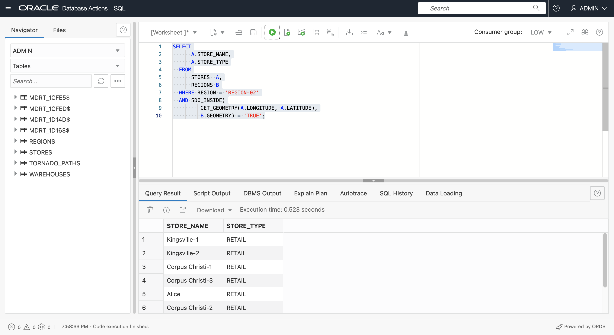
    
2.  Utilisez SDO\_INSIDE( ) pour renvoyer chaque magasin avec la région dans laquelle il se trouve. Voici un autre exemple d'utilisation d'un opérateur Spatial pour effectuer une jointure, comme précédemment avec SDO\_NN( ). Notez que les magasins situés sur une limite de région ne sont pas inclus. Pour inclure des magasins aux limites, utilisez SDO\_ANYINTERACT( ).
    
        <copy> 
        SELECT
              A.STORE_NAME,
              A.STORE_TYPE,
              B.REGION
          FROM
              STORES  A,
              REGIONS B
          WHERE SDO_INSIDE(
                GET_GEOMETRY(A.LONGITUDE, A.LATITUDE),
                B.GEOMETRY) = 'TRUE';
         </copy>
        
    
    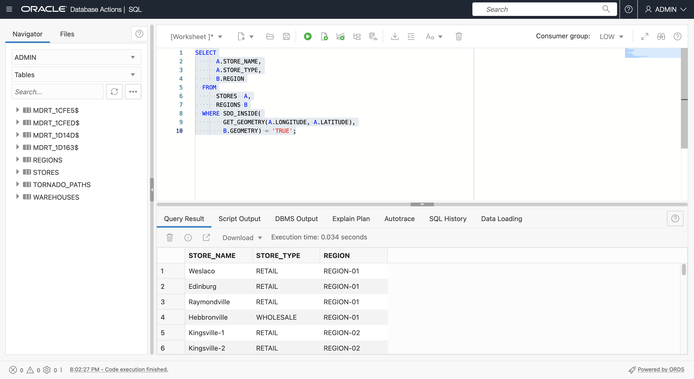
    
3.  Utilisez ensuite SDO\_ANYINTERACT( ) pour agréger les tornades par région. Exécutez la commande suivante pour renvoyer le nombre de tornades et la perte maximale pour chaque région. SDO\_ANYINTERACT( ) renvoie les éléments ayant une relation spatiale telle que les chemins de tornade qui sont entièrement ou partiellement contenus par une région.
    
        <copy> 
        SELECT
            B.REGION,
            COUNT(*),
            MAX(LOSS)
        FROM
            TORNADO_PATHS A,
            REGIONS       B
        WHERE
            SDO_ANYINTERACT(A.GEOMETRY, B.GEOMETRY) = 'TRUE'
        GROUP BY
            REGION
        ORDER BY
            REGION;
        </copy>
        
    
    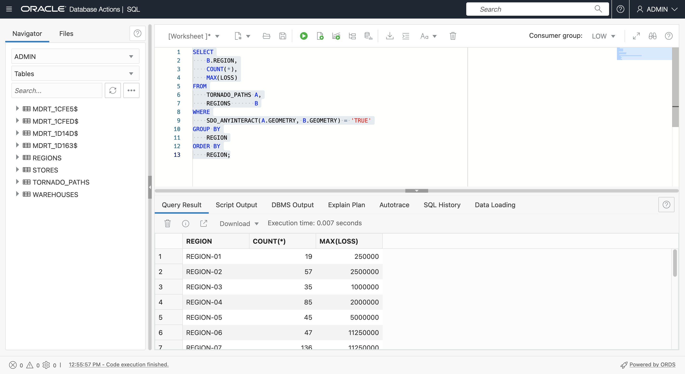
    
4.  Identifier les régions contenant des tornades dont la perte dépasse 100 000 $.
    
        <copy> 
          SELECT DISTINCT
              A.REGION
          FROM
              REGIONS       A,
              TORNADO_PATHS B
          WHERE
                 SDO_CONTAINS(A.GEOMETRY, B.GEOMETRY) = 'TRUE'
          AND 
                 B.LOSS > 100000
          ORDER BY
              REGION;
        </copy>
        
    
    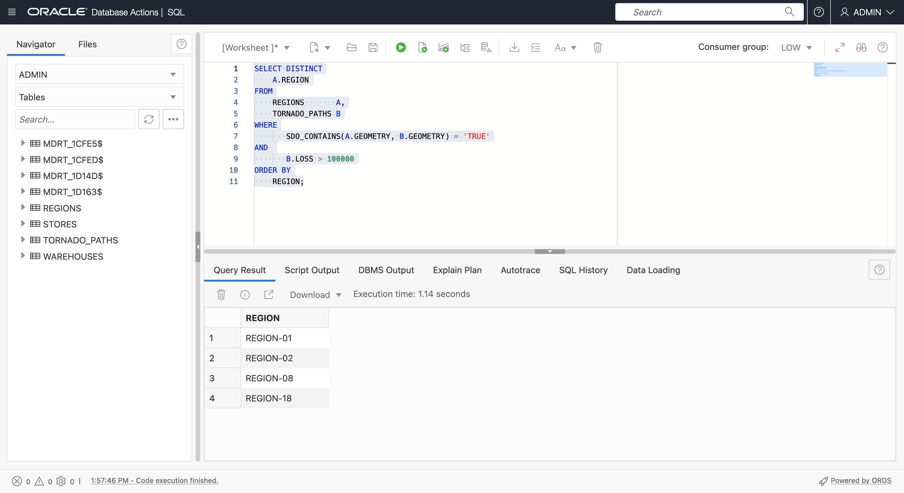
    
5.  Identifier les régions contenant des tornades dont la perte dépasse 100 000 $, ainsi que le nombre total de tornades.
    
        <copy> 
          SELECT DISTINCT
              A.REGION,
              COUNT(B.KEY)
          FROM
              REGIONS       A,
              TORNADO_PATHS B
          WHERE
                  SDO_CONTAINS(A.GEOMETRY, B.GEOMETRY) = 'TRUE'
              AND B.LOSS > 100000
          GROUP BY
              REGION
          ORDER BY
              REGION;
        </copy>
        
    
    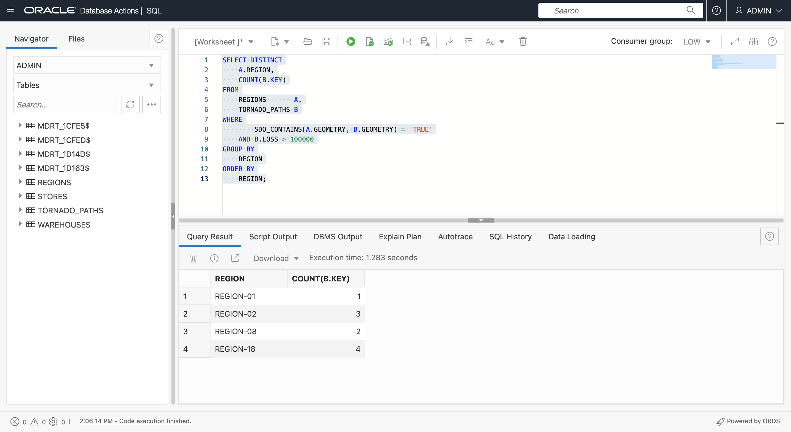
    

Vous pouvez maintenant **passer à l'exercice suivant**.

## En savoir plus

*   [Portail produit spatial](https://oracle.com/goto/spatial)
*   [Documentation spatiale](https://docs.oracle.com/en/database/oracle/oracle-database/19/spatl)
*   [Articles de blog sur Oracle Database Insider](https://blogs.oracle.com/database/category/db-spatial)

## Accusés de réception

*   **Auteur** - David Lapp, Database Product Management, Oracle
*   **Contributeurs** - Karin Patenge, Gestion des produits de base de données, Oracle
*   **Dernière mise à jour par/date** - David Lapp, septembre 2022