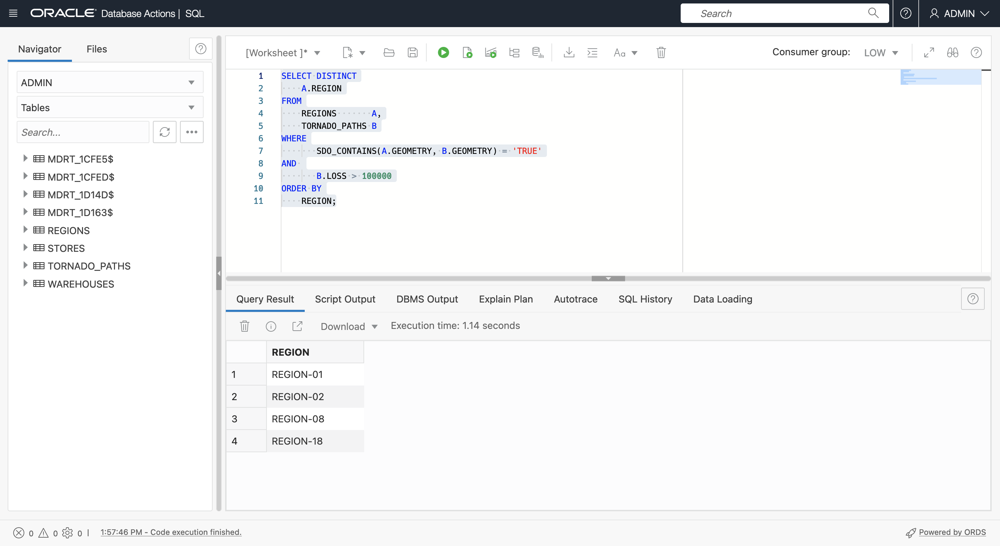

# 공간 질의

## 소개

이 실습에서는 Oracle Autonomous Database의 기본 공간 쿼리를 안내합니다. 이전 연습에서 생성한 샘플 데이터를 사용하여 근접도와 포함을 기반으로 항목을 식별합니다.

예상 시간: 20분

실습 과정을 간단히 살펴보려면 아래 비디오를 시청하십시오. [공간 데이터 준비](videohub:1_feaq2eu8)

### 목표

이 실습에서는 다음을 수행합니다.

*   Oracle Database에서 공간 쿼리에 대해 알아보기 및 수행

### 필요 조건

*   실습 3: 공간 데이터 준비

### 공간 질의 정보

Oracle Database에는 공간 분석을 위한 강력한 함수 및 연산자 라이브러리가 포함되어 있습니다. 여기에는 공간 관계, 측정값, 집계, 변환 등이 포함됩니다. 이러한 작업은 고유 SQL, PL/SQL, Java API 및 Python 및 Node.js과 같은 Oracle에 대한 연결 모듈이 있는 기타 언어를 통해 액세스할 수 있습니다.

가장 일반적인 작업은 공간 필터링 및 결합을 수행하는 공간 연산자와 계산 및 변환을 수행하는 공간 함수입니다.

공간 연산자는 INSIDE 또는 WITHIN\_DISTANCE와 같은 공간 관계를 테스트하고 관계가 존재할 때 'TRUE'를 반환합니다. 공간 연산자는 질의의 WHERE 절에 사용됩니다. 일반적으로 다음과 같습니다.

    <code>
    SELECT [fields]
    FROM [tables]
    WHERE [Spatial Operator]='TRUE'
    AND [other conditions...]
    </code>
    

예를 들어, MY\_POINTS에서 MY\_REGIONS의 REGION-01 내에 있는 항목을 식별하려면 다음과 같이 하십시오.

    <code>
    SELECT *
    FROM MY_POINTS A, MY_REGIONS B
    WHERE SDO_INSIDE(A.GEOMETRY, B.GEOMETRY) = 'TRUE'
    AND B.NAME='MY_REGION-01';
    </code>
    

Spatial Functions는 값을 반환하고 SELECT 리스트에 있거나 WHERE 절에서 사용할 수 있습니다. 일반적으로 다음과 같습니다.

    <code>
    SELECT [Spatial Function], [other fields...]
    FROM [tables]
    WHERE [conditions]
    </code>
    

예를 들어, MY\_REGIONS의 REGION-01 영역을 가져오려면 다음과 같이 하십시오.

    <code>
    SELECT SDO_GEOM.SDO_AREA(GEOMETRY)
    FROM MY_REGIONS
    WHERE NAME='MY_REGION-01';
    </code>
    

[여기](https://docs.oracle.com/en/database/oracle/oracle-database/19/spatl/spatial-reference-information.html)에서 설명한 대로 수백 개의 공간 SQL 및 PL/SQL 작업을 사용할 수 있습니다. 이 연습에서 가장 일반적인 내용을 살펴봅니다.

### 목표

이 실습에서는 공간 질의를 수행하여 상점, 창고, 지역 및 토네이도 경로 간의 위치 관계를 식별합니다.

### 필요 조건

*   실습 3: 공간 데이터 준비

## 작업 1: 근접 조회

근접성은 항목이 서로 얼마나 가까운지에 관한 것입니다. 두 가지 주요 공간 근접 연산자는 다음과 같습니다.

*   SDO\_WITH\_DISTANCE( )는 다른 항목의 지정된 거리 내에 있는 항목을 반환합니다.
*   SDO\_NN( )는 다른 항목에 가장 가까운 항목을 반환합니다.

1.  먼저 **SDO\_WITHIN\_DISTANCE( )**를 사용하여 댈러스 웨어하우스에서 20마일 이내에 매장을 식별합니다. **SDO\_WITHIN\_DISTANCE( )**에 대한 첫번째 인수는 형상 열이 아닌 STORES에 대한 형상을 반환하는 함수입니다. 연관된 함수 기반 공간 인덱스를 생성했으므로 이 인덱스를 사용할 수 있습니다.
    
        <copy> 
         SELECT
             STORE_NAME,
             STORE_TYPE
         FROM
             STORES     A,
             WAREHOUSES B
         WHERE
              B.WAREHOUSE_NAME = 'Dallas Warehouse'
         AND SDO_WITHIN_DISTANCE(
               GET_GEOMETRY(A.LONGITUDE, A.LATITUDE),
               B.GEOMETRY,
               'distance=20 unit=mile') = 'TRUE'
        </copy>
        
    
    
    
2.  다른 항목에 가장 가까운 항목을 식별하는 작업은 공간 연산자 **SDO\_NN( )**를 사용하여 수행됩니다. 여기서 NN은 가장 가까운 이웃을 나타냅니다. 다음 질의를 실행하여 Dallas Warehouse에 가장 가까운 매장 5개를 식별합니다. **SDO\_NN( )**에 대한 첫번째 인수는 함수 기반 공간 인덱스가 있는 형상을 반환하는 함수입니다.
    
        <copy> 
         SELECT
              STORE_NAME,
              STORE_TYPE
          FROM
              STORES     A,
              WAREHOUSES B
          WHERE B.WAREHOUSE_NAME = 'Dallas Warehouse'
           AND SDO_NN(
                GET_GEOMETRY(A.LONGITUDE, A.LATITUDE),
                B.GEOMETRY,
                'sdo_batch_size=10') = 'TRUE'
         AND ROWNUM <= 5;
        </copy>
        
    
    
    
3.  **SDO\_NN( )** 연산자를 사용하면 거리를 포함할 수 있습니다. 다음 질의를 실행하여 Dallas Warehouse에 가장 가까운 매장 5개와 거리(마일)를 반환합니다.
    
        <copy> 
         SELECT
              STORE_NAME,
              STORE_TYPE,
              ROUND( SDO_NN_DISTANCE(1) , 2) DISTANCE_MI
          FROM
              STORES     A,
              WAREHOUSES B
          WHERE B.WAREHOUSE_NAME = 'Dallas Warehouse'
           AND SDO_NN(
                GET_GEOMETRY(A.LONGITUDE, A.LATITUDE),
                B.GEOMETRY,
                'sdo_batch_size=10 unit=MILE', 1) = 'TRUE'
         AND ROWNUM <= 5;
        </copy>
        
    
    
    
4.  다음 질의를 실행하여 가장 가까운 5개의 소매점을 댈러스 웨어하우스와 거리(마일)로 되돌립니다. 소매점만 검색하므로 결과에 이전 결과보다 더 먼 점포가 포함됩니다.
    
        <copy> 
         SELECT
              STORE_NAME,
              STORE_TYPE,
              ROUND( SDO_NN_DISTANCE(1) , 2) DISTANCE_MI
          FROM
              STORES     A,
              WAREHOUSES B
          WHERE B.WAREHOUSE_NAME = 'Dallas Warehouse'
          AND A.STORE_TYPE='RETAIL'
           AND SDO_NN(
                GET_GEOMETRY(A.LONGITUDE, A.LATITUDE),
                B.GEOMETRY,
                'sdo_batch_size=10 unit=MILE', 1) = 'TRUE'
         AND ROWNUM <= 5;
        </copy>
        
    
    
    
5.  SDO\_NN( )와 같은 공간 연산자를 사용하여 조인을 생성할 수도 있습니다. 다음 query를 실행하여 각 store에 가장 가까운 warehouse라는 이름을 반환합니다.
    
        <copy> 
          SELECT a.store_name, b.warehouse_name
          FROM stores a,warehouses b
          WHERE SDO_NN(b.geometry,
                  get_geometry(a.longitude,a.latitude), 
                  'sdo_num_res=1') = 'TRUE';
        </copy>
        

4.  다음 질의를 실행하여 각 상점에 가장 가까운 창고의 이름과 거리(마일)를 반환합니다.
    
        <copy> 
          SELECT
              A.STORE_NAME,
              B.WAREHOUSE_NAME,
              ROUND( SDO_NN_DISTANCE(1) , 2) DISTANCE_MI
          FROM
              STORES     A,
              WAREHOUSES B
          WHERE
              SDO_NN(B.GEOMETRY,
                     GET_GEOMETRY(A.LONGITUDE, A.LATITUDE),
                     'sdo_num_res=1 unit=MILE', 1) = 'TRUE';
        </copy>
        

4.  근접성은 집계 분석에 유용합니다. 다음 질의를 실행하여 Dallas Warehouse에서 20마일 이내의 토네이도 수 및 최대 손실량을 반환합니다.
    
        <copy> 
           SELECT
               COUNT(A.KEY),
               MAX(A.LOSS)
           FROM
               TORNADO_PATHS A,
               WAREHOUSES B
           WHERE
               B.WAREHOUSE_NAME = 'Dallas Warehouse'
            AND SDO_WITHIN_DISTANCE( A.GEOMETRY,
                                     B.GEOMETRY,
                  'distance=20 unit=mile') = 'TRUE'
        </copy>
        
    
    
    
    1.  조인에 대해 공간 연산자 사용으로 돌아가서 다음 질의를 실행하여 토네이도 수와 최대 손실이 20마일 이내인 각 웨어하우스를 반환합니다.
    
        <copy> 
           SELECT
               B.WAREHOUSE_NAME,
               COUNT(A.KEY),
               MAX(A.LOSS)
           FROM
               TORNADO_PATHS A,
               WAREHOUSES B
           WHERE SDO_WITHIN_DISTANCE( A.GEOMETRY,
                                     B.GEOMETRY,
                  'distance=20 unit=mile') = 'TRUE'
           GROUP BY B.WAREHOUSE_NAME;  
        </copy>
        
    
    
    

query에서 거리 값을 20에서 50마일로 늘리고 새 결과를 확인합니다.

## 작업 2: 포함 질의

포함이란 특정 영역에 포함된 항목을 식별하고, 그 반대의 경우 특정 항목이 포함된 영역을 식별하는 것을 의미합니다. 공간 주 공간 포함 연산자는 다음과 같습니다.

*   SDO\_INSIDE( )는 영역 내에 있는 항목을 반환합니다. 경계의 항목은 반환되지 않습니다.
*   SDO\_CONTAINS( )는 항목이 포함된 영역을 반환합니다. 경계의 항목은 포함된 것으로 간주되지 않습니다.
*   SDO\_ANYINTERACT( )는 경계의 항목 또는 영역으로 교차하는 선과 같이 부분적으로 포함된 항목을 포함하여 다른 항목에 대한 공간 관계가 있는 항목을 반환합니다.

1.  경계에 점포를 포함하지 않고 REGION-02에 점포를 반환하려면 SDO\_INSIDE( )를 사용합니다.
    
        <copy> 
          SELECT
              A.STORE_NAME,
              A.STORE_TYPE
          FROM
              STORES  A,
              REGIONS B
          WHERE REGION = 'REGION-02'
          AND SDO_INSIDE(
                 GET_GEOMETRY(A.LONGITUDE, A.LATITUDE),
                 B.GEOMETRY) = 'TRUE';
         </copy>
        
    
    
    
2.  SDO\_INSIDE( )를 사용하여 각 저장소를 포함된 영역으로 반환합니다. 이전에 SDO\_NN( )에서 했던 것처럼 공간 연산자를 사용하여 조인을 수행하는 또 다른 예입니다. 지역 경계의 점포는 포함되지 않습니다. 경계에 점포를 포함하려면 SDO\_ANYINTERACT( )를 사용합니다.
    
        <copy> 
        SELECT
              A.STORE_NAME,
              A.STORE_TYPE,
              B.REGION
          FROM
              STORES  A,
              REGIONS B
          WHERE SDO_INSIDE(
                GET_GEOMETRY(A.LONGITUDE, A.LATITUDE),
                B.GEOMETRY) = 'TRUE';
         </copy>
        
    
    
    
3.  그런 다음 SDO\_ANYINTERACT( )를 사용하여 지역별로 토네이도를 집계합니다. 다음을 실행하여 각 지역의 토네이도 수 및 최대 손실량을 반환합니다. SDO\_ANYINTERACT( )는 영역에 의해 완전히 또는 부분적으로 포함된 토네이도 경로와 같은 공간 관계가 있는 항목을 반환합니다.
    
        <copy> 
        SELECT
            B.REGION,
            COUNT(*),
            MAX(LOSS)
        FROM
            TORNADO_PATHS A,
            REGIONS       B
        WHERE
            SDO_ANYINTERACT(A.GEOMETRY, B.GEOMETRY) = 'TRUE'
        GROUP BY
            REGION
        ORDER BY
            REGION;
        </copy>
        
    
    
    
4.  손실이 $100,000를 초과하는 토네이도가 포함된 지역을 식별합니다.
    
        <copy> 
          SELECT DISTINCT
              A.REGION
          FROM
              REGIONS       A,
              TORNADO_PATHS B
          WHERE
                 SDO_CONTAINS(A.GEOMETRY, B.GEOMETRY) = 'TRUE'
          AND 
                 B.LOSS > 100000
          ORDER BY
              REGION;
        </copy>
        
    
    
    
5.  총 토네이도 수와 함께 손실이 $100,000를 초과하는 토네이도가 포함된 지역을 식별합니다.
    
        <copy> 
          SELECT DISTINCT
              A.REGION,
              COUNT(B.KEY)
          FROM
              REGIONS       A,
              TORNADO_PATHS B
          WHERE
                  SDO_CONTAINS(A.GEOMETRY, B.GEOMETRY) = 'TRUE'
              AND B.LOSS > 100000
          GROUP BY
              REGION
          ORDER BY
              REGION;
        </copy>
        
    
    
    

이제 **다음 실습을 진행하십시오**.

## 자세히 알아보기

*   [공간 제품 포털](https://oracle.com/goto/spatial)
*   [공간 문서](https://docs.oracle.com/en/database/oracle/oracle-database/19/spatl)
*   [Oracle Database Insider에 대한 공간 블로그 게시물](https://blogs.oracle.com/database/category/db-spatial)

## 확인

*   **작성자** - David Lapp, Oracle 데이터베이스 제품 관리
*   **기여자** - Karin Patenge, Oracle 데이터베이스 제품 관리
*   **최종 업데이트 수행자/날짜** - David Lapp, 2022년 9월