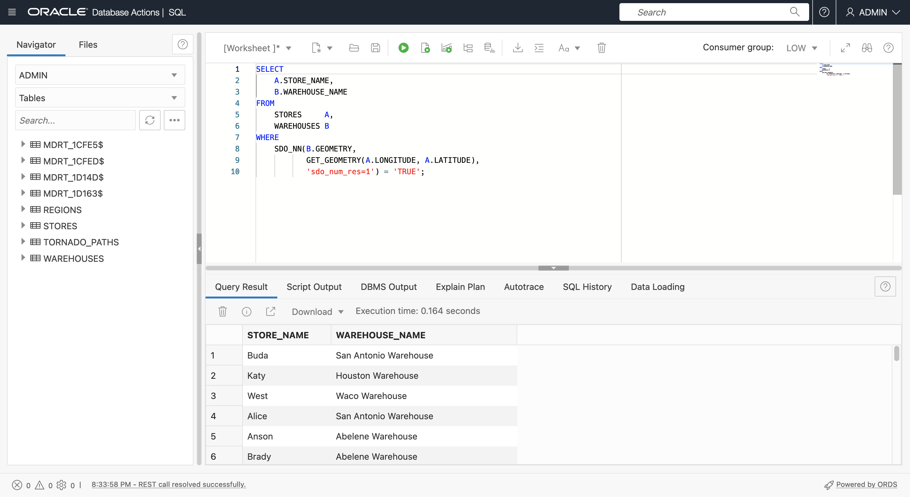

# Consultas espaciais

## Introdução

Este laboratório orienta você pelas consultas espaciais básicas no Oracle Autonomous Database. Você usará os dados de amostra criados no laboratório anterior para identificar itens com base na proximidade e na contenção.

Tempo Estimado: 20 minutos

Assista ao vídeo abaixo para uma rápida apresentação do laboratório. [Preparar dados espaciais](videohub:1_feaq2eu8)

### Objetivos

Neste laboratório, você vai:

*   Saiba mais sobre e execute consultas espaciais no Oracle Database

### Pré-requisitos

*   Conclusão do Laboratório 3: Preparar dados espaciais

### Sobre consultas espaciais

O Oracle Database inclui uma biblioteca robusta de funções e operadores para análise espacial. Isso inclui relacionamentos espaciais, medições, agregações, transformações e muito mais. Essas operações podem ser acessadas por meio de SQL nativo, PL/SQL, APIs Java e qualquer outra linguagem com módulos de conexão à Oracle, como Python e Node.js.

As operações mais comuns são Operadores Espaciais que executam filtragem e junção espaciais, e Funções Espaciais que executam cálculos e transformações.

Os Operadores Espaciais testam uma relação espacial, como INSIDE ou WITHIN\_DISTANCE e retornam 'TRUE' quando a relação existe. Os Operadores Espaciais são usados na cláusula WHERE de uma consulta. Genericamente, como segue:

    <code>
    SELECT [fields]
    FROM [tables]
    WHERE [Spatial Operator]='TRUE'
    AND [other conditions...]
    </code>
    

Por exemplo, para identificar itens em MY\_POINTS que estão dentro de REGION-01 de MY\_REGIONS:

    <code>
    SELECT *
    FROM MY_POINTS A, MY_REGIONS B
    WHERE SDO_INSIDE(A.GEOMETRY, B.GEOMETRY) = 'TRUE'
    AND B.NAME='MY_REGION-01';
    </code>
    

As Funções Espaciais retornam um valor e podem estar na lista SELECT ou ser usadas na cláusula WHERE. Genericamente, como segue:

    <code>
    SELECT [Spatial Function], [other fields...]
    FROM [tables]
    WHERE [conditions]
    </code>
    

Por exemplo, para obter a área de REGION-01 de MY\_REGIONS:

    <code>
    SELECT SDO_GEOM.SDO_AREA(GEOMETRY)
    FROM MY_REGIONS
    WHERE NAME='MY_REGION-01';
    </code>
    

Existem centenas de operações de SQL e PL/SQL disponíveis, conforme documentado [aqui](https://docs.oracle.com/en/database/oracle/oracle-database/19/spatl/spatial-reference-information.html). Você vai explorar alguns dos mais comuns neste laboratório.

### Objetivos

Neste laboratório, você executará consultas espaciais para identificar as relações de localização entre lojas, depósitos, regiões e caminhos de tornados.

### Pré-requisitos

*   Conclusão do Laboratório 3: Preparar Dados Espaciais

## Tarefa 1: Consultas de proximidade

A proximidade está relacionada ao quão próximos os itens estão uns dos outros. Os dois principais operadores de proximidade espacial são

*   SDO\_WITH\_DISTANCE( ) retorna itens dentro de uma determinada distância de outro item
*   SDO\_NN( ) retorna os itens mais próximos para outro item.

1.  Comece identificando lojas a menos de 20 milhas do Dallas Warehouse usando **SDO\_WITHIN\_DISTANCE( )**. Observe que o primeiro argumento para **SDO\_WITHIN\_DISTANCE( )** é a função que retorna a geometria para STORES (em vez de uma coluna de geometria). Você pode usar isso desde que criou um índice espacial baseado em função associado.
    
        <copy> 
         SELECT
             STORE_NAME,
             STORE_TYPE
         FROM
             STORES     A,
             WAREHOUSES B
         WHERE
              B.WAREHOUSE_NAME = 'Dallas Warehouse'
         AND SDO_WITHIN_DISTANCE(
               GET_GEOMETRY(A.LONGITUDE, A.LATITUDE),
               B.GEOMETRY,
               'distance=20 unit=mile') = 'TRUE'
        </copy>
        
    
    
    
2.  A identificação dos itens mais próximos de outro item é realizada com o operador Espacial **SDO\_NN( )**, em que NN significa Vizinho Mais Próximo. Execute a consulta a seguir para identificar as 5 lojas mais próximas do Dallas Warehouse. Novamente, observe que o primeiro argumento para **SDO\_NN( )** é a função que retorna a geometria, que tem um índice espacial baseado em função.
    
        <copy> 
         SELECT
              STORE_NAME,
              STORE_TYPE
          FROM
              STORES     A,
              WAREHOUSES B
          WHERE B.WAREHOUSE_NAME = 'Dallas Warehouse'
           AND SDO_NN(
                GET_GEOMETRY(A.LONGITUDE, A.LATITUDE),
                B.GEOMETRY,
                'sdo_batch_size=10') = 'TRUE'
         AND ROWNUM <= 5;
        </copy>
        
    
    
    
3.  O operador **SDO\_NN( )** permite incluir a distância. Execute a consulta a seguir para retornar as 5 lojas mais próximas ao Dallas Warehouse junto com suas distâncias em milhas.
    
        <copy> 
         SELECT
              STORE_NAME,
              STORE_TYPE,
              ROUND( SDO_NN_DISTANCE(1) , 2) DISTANCE_MI
          FROM
              STORES     A,
              WAREHOUSES B
          WHERE B.WAREHOUSE_NAME = 'Dallas Warehouse'
           AND SDO_NN(
                GET_GEOMETRY(A.LONGITUDE, A.LATITUDE),
                B.GEOMETRY,
                'sdo_batch_size=10 unit=MILE', 1) = 'TRUE'
         AND ROWNUM <= 5;
        </copy>
        
    
    
    
4.  Execute a consulta a seguir para retornar as 5 lojas de varejo mais próximas ao Dallas Warehouse junto com suas distâncias em milhas. Observe que o resultado inclui lojas mais distantes do resultado anterior, pois você só está procurando lojas de varejo.
    
        <copy> 
         SELECT
              STORE_NAME,
              STORE_TYPE,
              ROUND( SDO_NN_DISTANCE(1) , 2) DISTANCE_MI
          FROM
              STORES     A,
              WAREHOUSES B
          WHERE B.WAREHOUSE_NAME = 'Dallas Warehouse'
          AND A.STORE_TYPE='RETAIL'
           AND SDO_NN(
                GET_GEOMETRY(A.LONGITUDE, A.LATITUDE),
                B.GEOMETRY,
                'sdo_batch_size=10 unit=MILE', 1) = 'TRUE'
         AND ROWNUM <= 5;
        </copy>
        
    
    
    
5.  Operadores espaciais como SDO\_NN( ) também podem ser usados para criar uma junção. Execute a consulta a seguir para retornar cada armazenamento com o nome do depósito mais próximo.
    
        <copy> 
          SELECT a.store_name, b.warehouse_name
          FROM stores a,warehouses b
          WHERE SDO_NN(b.geometry,
                  get_geometry(a.longitude,a.latitude), 
                  'sdo_num_res=1') = 'TRUE';
        </copy>
        

4.  Execute a consulta a seguir para retornar cada armazenamento com o nome do depósito mais próximo juntamente com as distâncias em milhas.
    
        <copy> 
          SELECT
              A.STORE_NAME,
              B.WAREHOUSE_NAME,
              ROUND( SDO_NN_DISTANCE(1) , 2) DISTANCE_MI
          FROM
              STORES     A,
              WAREHOUSES B
          WHERE
              SDO_NN(B.GEOMETRY,
                     GET_GEOMETRY(A.LONGITUDE, A.LATITUDE),
                     'sdo_num_res=1 unit=MILE', 1) = 'TRUE';
        </copy>
        

4.  A proximidade é útil para análise agregada. Execute a consulta a seguir para retornar o número de tornados e a perda máxima em até 20 milhas do Dallas Warehouse.
    
        <copy> 
           SELECT
               COUNT(A.KEY),
               MAX(A.LOSS)
           FROM
               TORNADO_PATHS A,
               WAREHOUSES B
           WHERE
               B.WAREHOUSE_NAME = 'Dallas Warehouse'
            AND SDO_WITHIN_DISTANCE( A.GEOMETRY,
                                     B.GEOMETRY,
                  'distance=20 unit=mile') = 'TRUE'
        </copy>
        
    
    
    
    1.  Retornando ao uso de operadores Espaciais para junções, execute a consulta a seguir para retornar cada depósito com o número de tornados e a perda máxima em 20 milhas.
    
        <copy> 
           SELECT
               B.WAREHOUSE_NAME,
               COUNT(A.KEY),
               MAX(A.LOSS)
           FROM
               TORNADO_PATHS A,
               WAREHOUSES B
           WHERE SDO_WITHIN_DISTANCE( A.GEOMETRY,
                                     B.GEOMETRY,
                  'distance=20 unit=mile') = 'TRUE'
           GROUP BY B.WAREHOUSE_NAME;  
        </copy>
        
    
    
    

Aumente o valor da distância na consulta de 20 para 50 mi e observe o novo resultado.

## Tarefa 2: Consultas de contenção

Contenção refere-se à identificação de itens contidos por uma região específica e vice-versa, identificando regiões que contêm itens específicos. Os principais operadores espaciais de contenção espacial são

*   SDO\_INSIDE( ) retorna itens que estão dentro da(s) região(ões). Os itens no limite não são retornados.
*   SDO\_CONTAINS( ) retorna regiões que contêm item(ns). Os itens no limite não são considerados contidos.
*   SDO\_ANYINTERACT( ) retorna itens com qualquer relacionamento espacial com outro(s) item(ns), incluindo itens em um limite ou itens parcialmente contidos, como uma linha que cruza uma região.

1.  Use SDO\_INSIDE( ) para retornar lojas na REGION-02, não incluindo lojas no limite.
    
        <copy> 
          SELECT
              A.STORE_NAME,
              A.STORE_TYPE
          FROM
              STORES  A,
              REGIONS B
          WHERE REGION = 'REGION-02'
          AND SDO_INSIDE(
                 GET_GEOMETRY(A.LONGITUDE, A.LATITUDE),
                 B.GEOMETRY) = 'TRUE';
         </copy>
        
    
    
    
2.  Use SDO\_INSIDE( ) para retornar cada armazenamento com a região pela qual ele está contido. Este é outro exemplo de uso de um operador Espacial para executar uma junção, como você fez anteriormente com SDO\_NN( ). Observe que os armazenamentos em um limite de região não são incluídos. Para incluir lojas no limite, use SDO\_ANYINTERACT( ).
    
        <copy> 
        SELECT
              A.STORE_NAME,
              A.STORE_TYPE,
              B.REGION
          FROM
              STORES  A,
              REGIONS B
          WHERE SDO_INSIDE(
                GET_GEOMETRY(A.LONGITUDE, A.LATITUDE),
                B.GEOMETRY) = 'TRUE';
         </copy>
        
    
    
    
3.  Em seguida, use SDO\_ANYINTERACT( ) para fins de agregação de tornados por região. Execute o seguinte para retornar o número de tornados e a perda máxima para cada região. Observe que SDO\_ANYINTERACT( ) retorna itens com qualquer relacionamento espacial, como caminhos de tornado, que estão total ou parcialmente contidos por uma região.
    
        <copy> 
        SELECT
            B.REGION,
            COUNT(*),
            MAX(LOSS)
        FROM
            TORNADO_PATHS A,
            REGIONS       B
        WHERE
            SDO_ANYINTERACT(A.GEOMETRY, B.GEOMETRY) = 'TRUE'
        GROUP BY
            REGION
        ORDER BY
            REGION;
        </copy>
        
    
    
    
4.  Identifique regiões que contenham tornado(s) com perda acima de US$ 100.000.
    
        <copy> 
          SELECT DISTINCT
              A.REGION
          FROM
              REGIONS       A,
              TORNADO_PATHS B
          WHERE
                 SDO_CONTAINS(A.GEOMETRY, B.GEOMETRY) = 'TRUE'
          AND 
                 B.LOSS > 100000
          ORDER BY
              REGION;
        </copy>
        
    
    
    
5.  Identifique regiões contendo tornados com perda acima de US $ 100.000, juntamente com o número total de tornados.
    
        <copy> 
          SELECT DISTINCT
              A.REGION,
              COUNT(B.KEY)
          FROM
              REGIONS       A,
              TORNADO_PATHS B
          WHERE
                  SDO_CONTAINS(A.GEOMETRY, B.GEOMETRY) = 'TRUE'
              AND B.LOSS > 100000
          GROUP BY
              REGION
          ORDER BY
              REGION;
        </copy>
        
    
    
    

Agora você pode **prosseguir para o próximo laboratório**.

## Saiba mais

*   [Portal espacial de produtos](https://oracle.com/goto/spatial)
*   [Documentação espacial](https://docs.oracle.com/en/database/oracle/oracle-database/19/spatl)
*   [Publicações no blog Spatial sobre o Oracle Database Insider](https://blogs.oracle.com/database/category/db-spatial)

## Agradecimentos

*   **Autor** - David Lapp, Database Product Management, Oracle
*   **Colaboradores** - Karin Patenge, Database Product Management, Oracle
*   **Última Atualização em/Data** - David Lapp, setembro de 2022