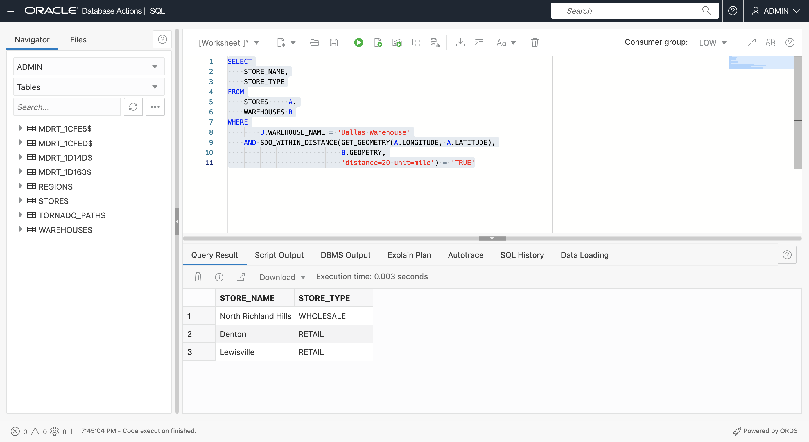
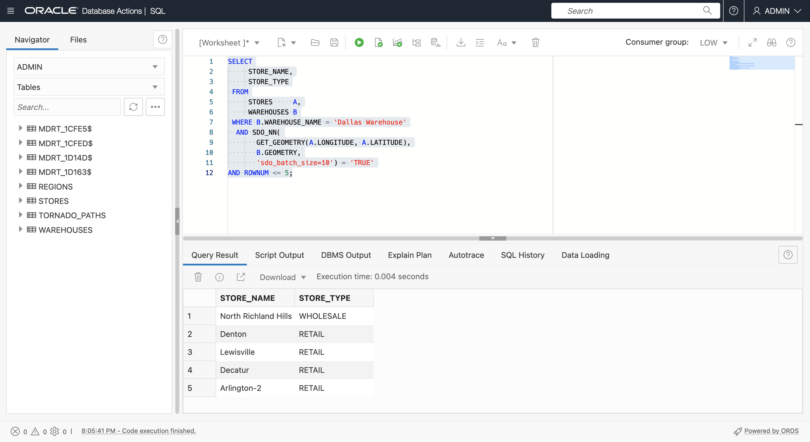
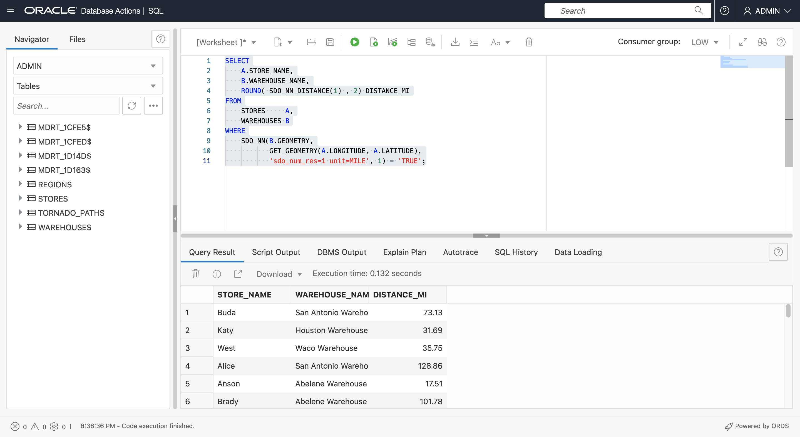
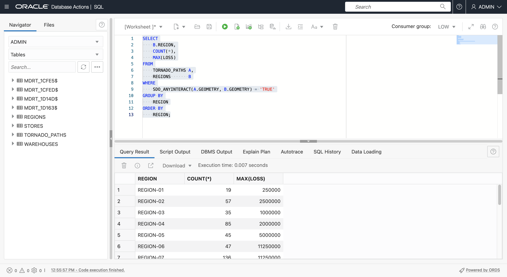

# 空间查询

## 简介

此实验室将指导您完成 Oracle Autonomous Database 中的基本空间查询。您将使用在上一个实验室中创建的示例数据基于邻近性和包含性来标识项。

估计时间：20 分钟

观看下面的视频，快速浏览实验室。[准备空间数据](videohub:1_feaq2eu8)

### 目标

在此实验室中，您将：

*   了解并执行 Oracle Database 中的空间查询

### 先备条件

*   实验室 3 的完成：准备空间数据

### 关于空间查询

Oracle Database 包含强大的函数和运算符库，可用于空间分析。这包括空间关系、测量、聚合、转换等。可以通过本机 SQL、PL/SQL、Java API 以及任何其他语言（包括与 Oracle 的连接模块，例如 Python 和 Node.js）访问这些操作。

最常见的操作是执行空间过滤和联接的空间运算符，以及执行计算和转换的空间函数。

空间运算符测试空间关系（如 INSIDE 或 WITHIN\_DISTANCE），并在关系存在时返回 'TRUE'。空间运算符用在查询的 WHERE 子句中。一般如下：

    <code>
    SELECT [fields]
    FROM [tables]
    WHERE [Spatial Operator]='TRUE'
    AND [other conditions...]
    </code>
    

例如，要标识 MY\_POINTS 中位于 MY\_REGIONS 的 REGION-01 内的项，请执行以下操作：

    <code>
    SELECT *
    FROM MY_POINTS A, MY_REGIONS B
    WHERE SDO_INSIDE(A.GEOMETRY, B.GEOMETRY) = 'TRUE'
    AND B.NAME='MY_REGION-01';
    </code>
    

空间函数会返回一个值，并且可以位于 SELECT 列表中，也可以用于 WHERE 子句。一般如下：

    <code>
    SELECT [Spatial Function], [other fields...]
    FROM [tables]
    WHERE [conditions]
    </code>
    

例如，要获取 MY\_REGIONS 的 REGION-01 区域：

    <code>
    SELECT SDO_GEOM.SDO_AREA(GEOMETRY)
    FROM MY_REGIONS
    WHERE NAME='MY_REGION-01';
    </code>
    

提供了数百个空间 SQL 和 PL/SQL 操作，如[此处](https://docs.oracle.com/en/database/oracle/oracle-database/19/spatl/spatial-reference-information.html)所述。您将探索此实验室中一些最常见的问题。

### 目标

在此实验室中，您将执行空间查询来确定商店、仓库、区域和龙卷风路径之间的位置关系。

### 先备条件

*   实验室 3 的完成：准备空间数据

## 任务 1：邻近查询

邻近关系到项目之间的距离。两个主要的空间接近运算符是

*   SDO\_WITH\_DISTANCE( ) 返回另一个项目给定距离内的项目
*   SDO\_NN( ) 返回到其他项的最近项。

1.  首先使用 **SDO\_WITHIN\_DISTANCE( )** 标识距离达拉斯仓库 20 英里的门店。请注意，**SDO\_WITHIN\_DISTANCE( )** 的第一个参数是返回 STORES 的几何图形（而不是几何图形列）的函数。由于创建了关联的基于函数的空间索引，因此可以使用此方法。
    
        <copy> 
         SELECT
             STORE_NAME,
             STORE_TYPE
         FROM
             STORES     A,
             WAREHOUSES B
         WHERE
              B.WAREHOUSE_NAME = 'Dallas Warehouse'
         AND SDO_WITHIN_DISTANCE(
               GET_GEOMETRY(A.LONGITUDE, A.LATITUDE),
               B.GEOMETRY,
               'distance=20 unit=mile') = 'TRUE'
        </copy>
        
    
    
    
2.  使用空间运算符 **SDO\_NN( )** （其中 NN 代表 "Nearest Neighbor"）可以标识最接近其他项的项。运行以下查询，确定距离达拉斯仓库最近的 5 家门店。再次请注意，**SDO\_NN( )** 的第一个参数是返回几何图形的函数，该函数具有基于函数的空间索引。
    
        <copy> 
         SELECT
              STORE_NAME,
              STORE_TYPE
          FROM
              STORES     A,
              WAREHOUSES B
          WHERE B.WAREHOUSE_NAME = 'Dallas Warehouse'
           AND SDO_NN(
                GET_GEOMETRY(A.LONGITUDE, A.LATITUDE),
                B.GEOMETRY,
                'sdo_batch_size=10') = 'TRUE'
         AND ROWNUM <= 5;
        </copy>
        
    
    
    
3.  **SDO\_NN( )** 运算符允许您包括距离。运行以下查询，返回距离达拉斯仓库最近的 5 个门店及其距离（以英里为单位）。
    
        <copy> 
         SELECT
              STORE_NAME,
              STORE_TYPE,
              ROUND( SDO_NN_DISTANCE(1) , 2) DISTANCE_MI
          FROM
              STORES     A,
              WAREHOUSES B
          WHERE B.WAREHOUSE_NAME = 'Dallas Warehouse'
           AND SDO_NN(
                GET_GEOMETRY(A.LONGITUDE, A.LATITUDE),
                B.GEOMETRY,
                'sdo_batch_size=10 unit=MILE', 1) = 'TRUE'
         AND ROWNUM <= 5;
        </copy>
        
    
    
    
4.  运行以下查询，将最近的 5 家零售店连同距离（以英里为单位）返回到达拉斯仓库。请注意，结果包括的商店比以前的结果更远，因为您重新只查找零售商店。
    
        <copy> 
         SELECT
              STORE_NAME,
              STORE_TYPE,
              ROUND( SDO_NN_DISTANCE(1) , 2) DISTANCE_MI
          FROM
              STORES     A,
              WAREHOUSES B
          WHERE B.WAREHOUSE_NAME = 'Dallas Warehouse'
          AND A.STORE_TYPE='RETAIL'
           AND SDO_NN(
                GET_GEOMETRY(A.LONGITUDE, A.LATITUDE),
                B.GEOMETRY,
                'sdo_batch_size=10 unit=MILE', 1) = 'TRUE'
         AND ROWNUM <= 5;
        </copy>
        
    
    
    
5.  还可以使用 SDO\_NN( ) 等空间运算符来创建联接。运行以下查询，返回名称为最近仓库的每个门店。
    
        <copy> 
          SELECT a.store_name, b.warehouse_name
          FROM stores a,warehouses b
          WHERE SDO_NN(b.geometry,
                  get_geometry(a.longitude,a.latitude), 
                  'sdo_num_res=1') = 'TRUE';
        </copy>
        

4.  运行以下查询，返回每个存储，其中包含最近仓库的名称以及距离（以英里为单位）。
    
        <copy> 
          SELECT
              A.STORE_NAME,
              B.WAREHOUSE_NAME,
              ROUND( SDO_NN_DISTANCE(1) , 2) DISTANCE_MI
          FROM
              STORES     A,
              WAREHOUSES B
          WHERE
              SDO_NN(B.GEOMETRY,
                     GET_GEOMETRY(A.LONGITUDE, A.LATITUDE),
                     'sdo_num_res=1 unit=MILE', 1) = 'TRUE';
        </copy>
        

4.  接近对于聚合分析非常有用。运行以下查询，返回距离达拉斯仓库 20 英里的龙卷风数和最大损失。
    
        <copy> 
           SELECT
               COUNT(A.KEY),
               MAX(A.LOSS)
           FROM
               TORNADO_PATHS A,
               WAREHOUSES B
           WHERE
               B.WAREHOUSE_NAME = 'Dallas Warehouse'
            AND SDO_WITHIN_DISTANCE( A.GEOMETRY,
                                     B.GEOMETRY,
                  'distance=20 unit=mile') = 'TRUE'
        </copy>
        
    
    
    
    1.  返回到使用空间运算符进行联接，运行以下查询以返回每个仓库，其中包含龙卷风数和 20 英里以内的最大损失。
    
        <copy> 
           SELECT
               B.WAREHOUSE_NAME,
               COUNT(A.KEY),
               MAX(A.LOSS)
           FROM
               TORNADO_PATHS A,
               WAREHOUSES B
           WHERE SDO_WITHIN_DISTANCE( A.GEOMETRY,
                                     B.GEOMETRY,
                  'distance=20 unit=mile') = 'TRUE'
           GROUP BY B.WAREHOUSE_NAME;  
        </copy>
        
    
    
    

将查询中的距离值从 20 英里增加到 50 英里，然后观察新结果。

## 任务 2：包含查询

区间是指标识特定区域包含的项目，反之亦然，标识包含特定项目的区域。空间主空间包含运算符为

*   SDO\_INSIDE( ) 返回区域内的项。不返回边界上的项。
*   SDO\_CONTAINS( ) 返回包含项的区域。边界上的项目不被视为包含。
*   SDO\_ANYINTERACT( ) 返回与其他项有任何空间关系的项，包括边界上的项或部分包含的项，例如跨越区域的行。

1.  使用 SDO\_INSIDE( ) 返回 REGION-02 中的存储，不包括边界上的存储。
    
        <copy> 
          SELECT
              A.STORE_NAME,
              A.STORE_TYPE
          FROM
              STORES  A,
              REGIONS B
          WHERE REGION = 'REGION-02'
          AND SDO_INSIDE(
                 GET_GEOMETRY(A.LONGITUDE, A.LATITUDE),
                 B.GEOMETRY) = 'TRUE';
         </copy>
        
    
    
    
2.  使用 SDO\_INSIDE( ) 返回每个存储及其包含的区域。这是使用空间运算符执行联接的另一个示例，如前面使用 SDO\_NN( ) 所示。请注意，不包括区域边界上的存储。要包括边界上的门店，请使用 SDO\_ANYINTERACT( )。
    
        <copy> 
        SELECT
              A.STORE_NAME,
              A.STORE_TYPE,
              B.REGION
          FROM
              STORES  A,
              REGIONS B
          WHERE SDO_INSIDE(
                GET_GEOMETRY(A.LONGITUDE, A.LATITUDE),
                B.GEOMETRY) = 'TRUE';
         </copy>
        
    
    
    
3.  接下来使用 SDO\_ANYINTERACT( ) 按区域聚合龙卷风。运行以下命令可返回每个区域的龙卷风数量和最大损失。请注意，SDO\_ANYINTERACT( ) 返回具有任何空间关系的项，例如完全或部分由区域包含的龙卷风路径。
    
        <copy> 
        SELECT
            B.REGION,
            COUNT(*),
            MAX(LOSS)
        FROM
            TORNADO_PATHS A,
            REGIONS       B
        WHERE
            SDO_ANYINTERACT(A.GEOMETRY, B.GEOMETRY) = 'TRUE'
        GROUP BY
            REGION
        ORDER BY
            REGION;
        </copy>
        
    
    
    
4.  确定损失超过 100,000 美元的龙卷风区域。
    
        <copy> 
          SELECT DISTINCT
              A.REGION
          FROM
              REGIONS       A,
              TORNADO_PATHS B
          WHERE
                 SDO_CONTAINS(A.GEOMETRY, B.GEOMETRY) = 'TRUE'
          AND 
                 B.LOSS > 100000
          ORDER BY
              REGION;
        </copy>
        
    
    
    
5.  确定损失超过 100,000 美元的龙卷风区域以及龙卷风总数。
    
        <copy> 
          SELECT DISTINCT
              A.REGION,
              COUNT(B.KEY)
          FROM
              REGIONS       A,
              TORNADO_PATHS B
          WHERE
                  SDO_CONTAINS(A.GEOMETRY, B.GEOMETRY) = 'TRUE'
              AND B.LOSS > 100000
          GROUP BY
              REGION
          ORDER BY
              REGION;
        </copy>
        
    
    
    

现在，您可以**进入下一个练习**。

## 了解详细信息

*   [空间产品门户](https://oracle.com/goto/spatial)
*   [空间文档](https://docs.oracle.com/en/database/oracle/oracle-database/19/spatl)
*   [Oracle Database Insider 上的 Spatial 博客文章](https://blogs.oracle.com/database/category/db-spatial)

## 确认

*   **作者** - David Lapp，Oracle 数据库产品管理
*   **贡献者** - Oracle 数据库产品管理云平台 Karin Patenge
*   **上次更新者/日期** - David Lapp，2022 年 9 月