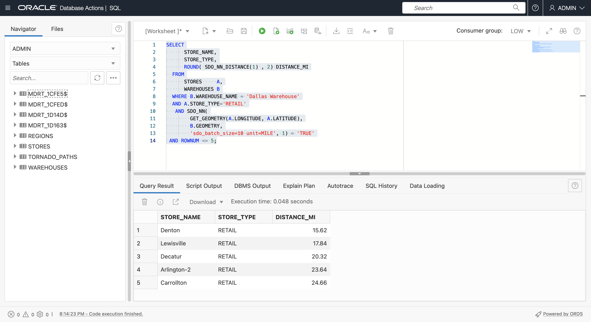

# 空間查詢

## 簡介

這個實驗室會逐步介紹 Oracle Autonomous Database 的基本空間查詢。您將使用先前實驗室中建立的樣本資料，根據鄰近與包含內容來識別項目。

預估時間：20 分鐘

請觀看下方影片，快速瞭解實驗室的逐步解說。[準備空間資料](videohub:1_feaq2eu8)

### 目標

在此實驗室中，您將：

*   瞭解及執行 Oracle Database 中的空間查詢

### 先決條件

*   完成實驗室 3：準備空間資料

### 關於空間查詢

Oracle Database 包含強大的函數庫和用於空間分析的運算子。這包括空間關係、測量、聚總和轉換等。您可以使用原生 SQL、PL/SQL、Java API 及任何其他與 Oracle 連線模組 (例如 Python 和 Node.js) 存取這些作業。

最常見的作業是執行空間篩選與結合的空間運算子，以及執行計算與轉換的空間函數。

「空間運算子」會測試空間關係 , 例如 INSIDE 或 WITHIN\_DISTANCE, 並在關係存在時傳回 」TRUE'。空間運算子用於查詢的 WHERE 子句中。一般如下：

    <code>
    SELECT [fields]
    FROM [tables]
    WHERE [Spatial Operator]='TRUE'
    AND [other conditions...]
    </code>
    

例如，若要識別 MY\_POINTS 中 MY\_REGIONS 之 REGION-01 內的項目：

    <code>
    SELECT *
    FROM MY_POINTS A, MY_REGIONS B
    WHERE SDO_INSIDE(A.GEOMETRY, B.GEOMETRY) = 'TRUE'
    AND B.NAME='MY_REGION-01';
    </code>
    

「空間函數」會傳回值，可以在 SELECT 清單中或使用在 WHERE 子句中。一般如下：

    <code>
    SELECT [Spatial Function], [other fields...]
    FROM [tables]
    WHERE [conditions]
    </code>
    

例如，若要取得 MY\_REGIONS 的 REGION-01 區域：

    <code>
    SELECT SDO_GEOM.SDO_AREA(GEOMETRY)
    FROM MY_REGIONS
    WHERE NAME='MY_REGION-01';
    </code>
    

有數以百計的空間 SQL 和 PL/SQL 作業可供使用，如[此處](https://docs.oracle.com/en/database/oracle/oracle-database/19/spatl/spatial-reference-information.html)所述。您將探索此實驗室中一些最常見的功能。

### 目標

在此實驗室中，您將執行空間查詢，識別存放區、倉儲、區域及龍捲風路徑之間的位置關係。

### 先決條件

*   完成實驗室 3：準備空間資料

## 作業 1：鄰近查詢

接近項目彼此間的接觸方式。兩個主要的空間鄰近運算子為

*   SDO\_WITH\_DISTANCE () 傳回指定距離內其他項目的項目
*   SDO\_NN () 會將最接近的項目傳回到另一個項目。

1.  從使用 **SDO\_WITHIN\_DISTANCE ()** 識別 Dallas Warehouse 20 英里內的商店開始。請注意，**SDO\_WITHIN\_DISTANCE ()** 的第一個引數是傳回 STORES (而非幾何資料欄) 幾何圖形的函數。自從建立關聯的函數型空間索引後，就能夠使用此功能。
    
        <copy> 
         SELECT
             STORE_NAME,
             STORE_TYPE
         FROM
             STORES     A,
             WAREHOUSES B
         WHERE
              B.WAREHOUSE_NAME = 'Dallas Warehouse'
         AND SDO_WITHIN_DISTANCE(
               GET_GEOMETRY(A.LONGITUDE, A.LATITUDE),
               B.GEOMETRY,
               'distance=20 unit=mile') = 'TRUE'
        </copy>
        
    
    
    
2.  使用「空間」運算子 **SDO\_NN ()** 來識別最接近另一個項目的項目，其中 NN 代表「最近的鄰近」。執行下列查詢以識別 Dallas Warehouse 最接近的 5 家商店。同樣地，請注意 **SDO\_NN ()** 的第一個引數是傳回幾何資料的函數，它具有以函數為基礎的空間索引。
    
        <copy> 
         SELECT
              STORE_NAME,
              STORE_TYPE
          FROM
              STORES     A,
              WAREHOUSES B
          WHERE B.WAREHOUSE_NAME = 'Dallas Warehouse'
           AND SDO_NN(
                GET_GEOMETRY(A.LONGITUDE, A.LATITUDE),
                B.GEOMETRY,
                'sdo_batch_size=10') = 'TRUE'
         AND ROWNUM <= 5;
        </copy>
        
    
    
    
3.  **SDO\_NN ()** 運算子可讓您包含距離。執行下列查詢以將 5 個最接近的商店傳回 Dallas Warehouse，以及其距離以英里為單位。
    
        <copy> 
         SELECT
              STORE_NAME,
              STORE_TYPE,
              ROUND( SDO_NN_DISTANCE(1) , 2) DISTANCE_MI
          FROM
              STORES     A,
              WAREHOUSES B
          WHERE B.WAREHOUSE_NAME = 'Dallas Warehouse'
           AND SDO_NN(
                GET_GEOMETRY(A.LONGITUDE, A.LATITUDE),
                B.GEOMETRY,
                'sdo_batch_size=10 unit=MILE', 1) = 'TRUE'
         AND ROWNUM <= 5;
        </copy>
        
    
    
    
4.  執行下列查詢，將 5 個最接近的零售商店傳回 Dallas Warehouse 以及其距離 (英哩)。請注意，此結果包含的商店遠高於先前的結果，因為您僅需尋找零售商店。
    
        <copy> 
         SELECT
              STORE_NAME,
              STORE_TYPE,
              ROUND( SDO_NN_DISTANCE(1) , 2) DISTANCE_MI
          FROM
              STORES     A,
              WAREHOUSES B
          WHERE B.WAREHOUSE_NAME = 'Dallas Warehouse'
          AND A.STORE_TYPE='RETAIL'
           AND SDO_NN(
                GET_GEOMETRY(A.LONGITUDE, A.LATITUDE),
                B.GEOMETRY,
                'sdo_batch_size=10 unit=MILE', 1) = 'TRUE'
         AND ROWNUM <= 5;
        </copy>
        
    
    
    
5.  空間運算子 (例如 SDO\_NN ()) 也可用來建立結合。執行下列查詢以傳回每個具有最接近倉儲名稱的商店。
    
        <copy> 
          SELECT a.store_name, b.warehouse_name
          FROM stores a,warehouses b
          WHERE SDO_NN(b.geometry,
                  get_geometry(a.longitude,a.latitude), 
                  'sdo_num_res=1') = 'TRUE';
        </copy>
        

4.  執行下列查詢以傳回每個具有最接近倉儲名稱的商店，以及距離 (英哩)。
    
        <copy> 
          SELECT
              A.STORE_NAME,
              B.WAREHOUSE_NAME,
              ROUND( SDO_NN_DISTANCE(1) , 2) DISTANCE_MI
          FROM
              STORES     A,
              WAREHOUSES B
          WHERE
              SDO_NN(B.GEOMETRY,
                     GET_GEOMETRY(A.LONGITUDE, A.LATITUDE),
                     'sdo_num_res=1 unit=MILE', 1) = 'TRUE';
        </copy>
        

4.  鄰近有助於聚總分析。執行下列查詢以傳回托納多斯數目，並在達拉斯倉庫的 20 英里內的最大損失。
    
        <copy> 
           SELECT
               COUNT(A.KEY),
               MAX(A.LOSS)
           FROM
               TORNADO_PATHS A,
               WAREHOUSES B
           WHERE
               B.WAREHOUSE_NAME = 'Dallas Warehouse'
            AND SDO_WITHIN_DISTANCE( A.GEOMETRY,
                                     B.GEOMETRY,
                  'distance=20 unit=mile') = 'TRUE'
        </copy>
        
    
    
    
    1.  返回使用空間運算子進行結合，執行下列查詢以傳回每一個倉儲，其數量為托納多且最大損失為 20 英里以內。
    
        <copy> 
           SELECT
               B.WAREHOUSE_NAME,
               COUNT(A.KEY),
               MAX(A.LOSS)
           FROM
               TORNADO_PATHS A,
               WAREHOUSES B
           WHERE SDO_WITHIN_DISTANCE( A.GEOMETRY,
                                     B.GEOMETRY,
                  'distance=20 unit=mile') = 'TRUE'
           GROUP BY B.WAREHOUSE_NAME;  
        </copy>
        
    
    
    

將查詢中的距離值從 20 到 50 mi，然後觀察新結果。

## 作業 2：包含查詢

容器是指識別特定區域所包含的項目，反之亦然，可識別包含特定項目的區域。空間主要空間包含運算子為

*   SDO\_INSIDE () 傳回在區域內的項目 。未傳回邊界上的項目。
*   SDO\_CONTAINS () 傳回包含項目的區域。邊界上的項目不被視為包含。
*   SDO\_ANYINTERACT () 會傳回與其他項目具有任何空間關係的項目，包括邊界上的項目或部分包含的項目，例如跨越區域的行。

1.  使用 SDO\_INSIDE () 傳回 REGION-02 中的商店，但不包括邊界上的商店。
    
        <copy> 
          SELECT
              A.STORE_NAME,
              A.STORE_TYPE
          FROM
              STORES  A,
              REGIONS B
          WHERE REGION = 'REGION-02'
          AND SDO_INSIDE(
                 GET_GEOMETRY(A.LONGITUDE, A.LATITUDE),
                 B.GEOMETRY) = 'TRUE';
         </copy>
        
    
    
    
2.  使用 SDO\_INSIDE () 傳回每個商店及其所含區域。這是另一個使用「空間」運算子來執行結合的範例，就像您之前使用 SDO\_NN ()。請注意，不包含區域邊界上的商店。若要在邊界上包含商店，請使用 SDO\_ANYINTERACT ()。
    
        <copy> 
        SELECT
              A.STORE_NAME,
              A.STORE_TYPE,
              B.REGION
          FROM
              STORES  A,
              REGIONS B
          WHERE SDO_INSIDE(
                GET_GEOMETRY(A.LONGITUDE, A.LATITUDE),
                B.GEOMETRY) = 'TRUE';
         </copy>
        
    
    
    
3.  下次使用 SDO\_ANYINTERACT () 來依區域聚總龍捲風。執行以下步驟，傳回每個區域的龍捲風數目和最大損失。請注意，SDO\_ANYINTERACT () 會傳回具有任何空間關係的項目，例如區域完整或部分包含的龍捲風路徑。
    
        <copy> 
        SELECT
            B.REGION,
            COUNT(*),
            MAX(LOSS)
        FROM
            TORNADO_PATHS A,
            REGIONS       B
        WHERE
            SDO_ANYINTERACT(A.GEOMETRY, B.GEOMETRY) = 'TRUE'
        GROUP BY
            REGION
        ORDER BY
            REGION;
        </copy>
        
    
    
    
4.  識別含有損失超過 $100,000 的龍捲風區域。
    
        <copy> 
          SELECT DISTINCT
              A.REGION
          FROM
              REGIONS       A,
              TORNADO_PATHS B
          WHERE
                 SDO_CONTAINS(A.GEOMETRY, B.GEOMETRY) = 'TRUE'
          AND 
                 B.LOSS > 100000
          ORDER BY
              REGION;
        </copy>
        
    
    
    
5.  識別包含龍捲風超過 10 萬美元的區域以及龍捲風總數。
    
        <copy> 
          SELECT DISTINCT
              A.REGION,
              COUNT(B.KEY)
          FROM
              REGIONS       A,
              TORNADO_PATHS B
          WHERE
                  SDO_CONTAINS(A.GEOMETRY, B.GEOMETRY) = 'TRUE'
              AND B.LOSS > 100000
          GROUP BY
              REGION
          ORDER BY
              REGION;
        </copy>
        
    
    
    

您現在可以**進入下一個實驗室**。

## 進一步瞭解

*   [空間產品入口網站](https://oracle.com/goto/spatial)
*   [空間文件](https://docs.oracle.com/en/database/oracle/oracle-database/19/spatl)
*   [Oracle Database Insider 的空間部落格文章](https://blogs.oracle.com/database/category/db-spatial)

## 確認

*   **作者** - Oracle 資料庫產品管理 David Lapp
*   **貢獻者** - Karin Patenge，Database Product Management，Oracle
*   **上次更新者 / 日期** - David Lapp，2022 年 9 月